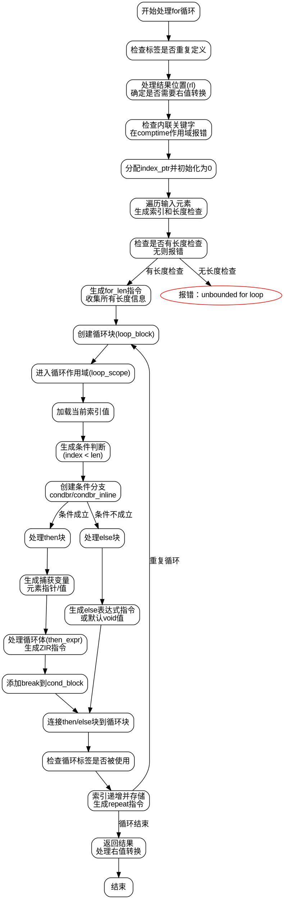

好的，我现在需要帮助用户根据提供的Zig代码生成一个流程图。首先，我需要仔细阅读并理解这段代码的功能和结构。这段代码是处理Zig中的for循环表达式的AST生成部分，属于编译器前端的工作。函数名为forExpr，参数包括父GenZir指针、作用域、结果信息、节点、完整的for循环AST节点以及是否是语句的标志。

首先，我需要理清函数的主要流程。函数开始时处理标签，检查是否有重复定义。然后处理结果位置（rl），确定是否需要右值转换。接下来处理内联关键字，检查是否在编译时作用域中冗余使用inline。然后分配索引指针（index_ptr）并初始化为零。

接下来，处理输入（inputs）中的每个元素，可能是范围或索引变量，生成对应的索引和长度检查。如果没有任何长度检查，会报错。然后生成一个for_len指令，收集所有长度信息，用于后续条件判断。

之后，创建循环块（loop_block），进入循环作用域（loop_scope）。在循环作用域内，生成条件判断，比较当前索引和长度。根据条件结果，生成条件分支（condbr），分为then块和else块。

在then块中，处理捕获变量（payload），生成对应的元素指针或值，并创建局部作用域。然后处理循环体（then_expr），生成对应的ZIR指令，并处理可能的断点或继续。最后添加break指令，结束then块。

在else块中，处理else表达式（如果有的话），同样生成对应的指令，并根据是否为语句处理结果。如果没有else表达式，生成默认的void值并break。

循环结束后，处理循环标签是否被使用，生成错误如果未使用。然后设置条件分支的payload，将then和else块连接到循环块。在循环块末尾，增加索引并存储，然后重复循环。

最后，根据是否需要右值转换，返回结果，并确保结果被使用（如果是语句）。

接下来，我需要将这些步骤转化为流程图。流程图应涵盖主要的分支和循环结构，包括条件判断、循环体的处理、else处理、索引更新等。需要注意函数中的各个作用域块（如loop_scope、cond_scope、then_scope、else_scope）的创建和连接，以及它们如何影响控制流。

可能的节点包括开始、处理标签、分配index_ptr、处理输入元素、生成for_len指令、创建循环块、条件判断、then块处理、else块处理、索引递增、循环重复等。条件判断会导致分支到then或else，循环结束后继续执行后续代码。

需要注意错误处理的情况，如标签未使用、未绑定的循环等，这些可能在流程图中以错误节点表示。此外，内联循环和普通循环的不同处理可能需要不同的分支。

最后，使用Graphviz的dot语言将上述逻辑结构化为流程图，确保各个步骤和条件分支正确连接，并标注每个节点的操作和判断条件。
================================================
