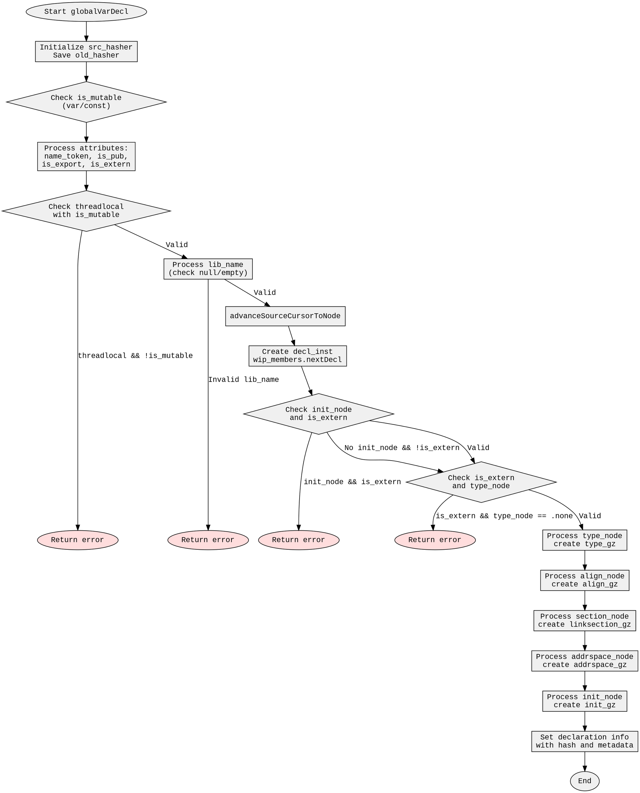

嗯，用户让我用Graphviz来画这个Zig函数的流程图，而且不能用Mermaid。好的，首先我需要理解这个函数的逻辑，然后分解成各个步骤，再转化为流程图的结构。

首先，这个函数叫globalVarDecl，看起来是处理全局变量声明的。函数参数有astgen、gz、scope、wip_members、node、var_decl。接下来，函数内部有很多变量声明和条件判断，比如检查是否是可变变量（var或const）、可见性（pub）、导出（export/extern）、线程局部（threadlocal）等。

我需要逐步分析每个步骤。比如，一开始保存旧的hasher，然后初始化新的src_hasher，并更新源内容。接着处理各种属性：is_mutable、name_token、is_pub、is_export、is_extern、is_threadlocal、lib_name等。然后处理初始化和类型检查，比如如果有extern就不能有初始化，否则必须有初始化。

之后，创建type_gz、align_gz、linksection_gz、addrspace_gz、init_gz这些子块，每个可能对应不同的节点。每个子块可能对应不同的处理流程，比如类型表达式、对齐、链接段、地址空间、初始化表达式等。最后设置声明信息，包括哈希、源代码位置、变量类型、名称、链接方式等。

流程图应该从函数入口开始，每个主要的条件判断和子块处理作为不同的节点。比如，首先处理hasher，然后检查各种属性（is_mutable、is_export等），然后是lib_name的处理，接着是初始化节点的检查（是否有extern，是否有初始化），然后是各个子块的创建和处理，最后设置声明信息并结束。

需要注意的是，每个条件判断可能会导致不同的路径，比如如果is_extern为真，则不能有初始化节点，否则必须有。这些条件分支需要在流程图中体现。另外，错误处理的部分，比如返回failNode的地方，也需要作为终止节点。

还有，每个子块（type_gz、align_gz等）的处理可能涉及进一步的表达式生成，这些可能需要作为子流程，但可能在主流程中简化为处理步骤。可能需要将这些子块的处理作为不同的步骤节点，或者用子图来表示。

总之，流程图的结构大致是：开始 -> 初始化hasher -> 处理变量属性 -> 检查初始化和类型 -> 处理各个子块（类型、对齐、链接段、地址空间、初始化） -> 设置声明信息 -> 结束。其中每个条件判断会有分支，错误情况会提前终止。

现在需要考虑如何将这些步骤用Graphviz的节点和边连接起来。可能需要使用菱形表示条件判断，矩形表示处理步骤，圆形或椭圆形表示开始和结束。同时，错误返回作为终止节点。

例如：

开始 -> 初始化src_hasher
初始化src_hasher -> 检查is_mutable
检查is_mutable -> 处理name_token、is_pub等
处理属性 -> 检查threadlocal是否可变
如果threadlocal不可变，返回错误
否则继续
然后处理lib_name，检查是否有空字节或空字符串，如果有错误则返回
接着advanceSourceCursorToNode
处理decl_column和decl_inst
检查是否有初始化节点和是否extern，对应不同的错误
处理type_node，创建type_gz子块
处理align_node，创建align_gz子块
处理section_node，创建linksection_gz子块
处理addrspace_node，创建addrspace_gz子块
处理init_node，创建init_gz子块
最后生成hash，设置声明信息，结束。

每个步骤之间的顺序和条件分支需要正确连接。可能需要将每个条件判断拆分为不同的节点，并用边表示true/false的情况。

例如，处理is_extern和是否有init_node的部分：

检查是否有init_node.unwrap()，如果是，则检查is_extern，如果为真，返回错误。否则继续。

这部分可以用条件判断节点，分出两个路径。

同样，处理各个子块时，如果有对应的节点（如type_node存在），则进入处理，否则跳过。

可能每个子块的处理都是一个条件判断，例如“type_node存在吗？”如果存在，则处理type_inst，否则跳过。

最后，设置声明信息，结束流程。

这样，整个流程图的结构就比较清晰了。需要将这些步骤转化为Graphviz的dot语法，使用节点和边，以及条件分支的表示。
================================================
