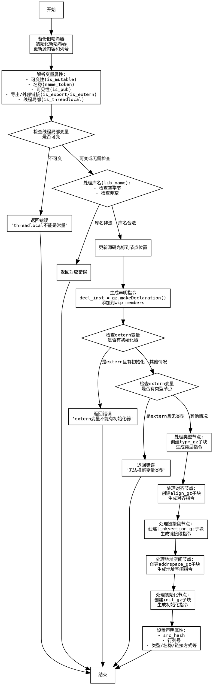

好的，我需要为给定的 Zig 函数 `globalVarDecl` 生成流程图。首先，我需要理解这个函数的结构和逻辑。让我先通读一遍代码，了解各个部分的作用。

函数的主要任务似乎是处理全局变量的声明，包括处理可变性、可见性（pub）、导出（export/extern）、线程局部存储（threadlocal）、库名（lib_name）、类型、对齐（align）、链接段（linksection）、地址空间（addrspace）以及初始化表达式等。

接下来，我需要确定函数的主要流程步骤：

1. **初始化哈希器**：保存旧的哈希器状态，并初始化新的哈希器，更新源内容。
2. **解析变量声明的属性**：如是否可变（var/const）、名称、可见性、导出、extern、线程局部、库名等。
3. **错误检查**：例如线程局部变量必须是可变的，检查库名是否合法，处理extern变量的初始化问题等。
4. **生成声明指令**：使用`gz.makeDeclaration`创建声明，并添加到成员列表中。
5. **处理类型、对齐、链接段、地址空间和初始化表达式**：分别为每个部分创建子块（GenZir），生成相应的ZIR指令。
6. **设置声明属性**：将收集到的所有信息（如哈希、行号、列号、类型、名称、链接方式等）设置到声明中。

现在，我需要将这些步骤转化为流程图中的节点，并确定它们之间的逻辑流向。可能的条件分支包括：

- 是否是可变的（is_mutable）
- 是否有初始化节点（var_decl.ast.init_node）
- 是否是extern变量
- 是否有类型节点、对齐节点、链接段节点、地址空间节点等

每个条件分支会导致不同的处理路径，例如，当变量是extern时，不允许有初始化器，而没有extern时必须初始化。这些条件需要在流程图中体现出来。

此外，错误处理（如返回错误）也需要作为终止节点表示出来。

接下来，我需要将这些逻辑结构用Graphviz的节点和边来表示。节点用矩形框，条件判断用菱形框，边上的标签表示条件或操作。

可能的结构如下：

开始 -> 初始化哈希器 -> 解析属性 -> 检查线程局部是否合法（错误则终止） -> 处理库名（错误则终止） -> 生成声明指令 -> 检查是否有初始化节点（是/否） -> 如果是extern且有初始化则报错 -> 处理类型、对齐等子块 -> 设置声明属性 -> 结束

每个子块的处理（类型、对齐等）可能需要独立的流程，但由于它们在代码中是顺序执行的，可能不需要并行分支，而是按顺序处理。

需要注意错误处理的分支，例如在检查库名是否包含空字节或为空时，会直接返回错误，这些情况需要在流程图中体现为终止节点。

最后，确保所有可能的执行路径都被覆盖，并且条件判断正确连接。
================================================
