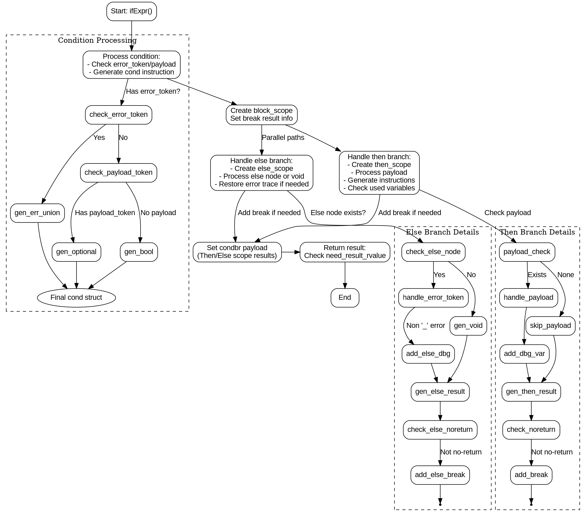

嗯，我需要为这个Zig函数`ifExpr`画一个流程图。首先，我得理解这个函数的结构和逻辑。看起来这个函数处理的是if表达式，生成对应的ZIR指令。函数参数里有parent_gz、scope、ri、node和if_full。函数里有很多条件判断，比如处理错误跟踪、payload是否引用等。

首先，函数开始处理条件表达式，根据是否有error_token或payload_token，生成不同的条件判断指令。然后创建block_scope，处理then分支和else分支。在then分支里，可能会处理错误联合体或者可选类型的payload，生成相应的局部变量和作用域。else分支类似，处理错误代码或者直接返回void。最后，根据条件分支的结果，设置condbr的payload，并根据是否需要rvalue返回结果。

接下来，我需要将这些步骤转化为流程图的各个节点和分支。可能需要分块处理：初始化部分、条件处理、then分支、else分支、结果返回等。每个条件判断对应不同的路径，比如是否有error_token，是否有payload_token，是否需要进行错误跟踪等。需要注意各个子作用域的创建和解除，以及指令的生成和添加到父作用域。

可能的结构是：

1. 开始节点：函数入口。
2. 处理条件表达式，根据是否有error_token或payload_token生成不同的条件指令。
3. 创建block_scope，设置break结果信息。
4. 处理then分支：创建then_scope，处理payload，生成指令，检查是否使用局部变量，添加break指令。
5. 处理else分支：创建else_scope，如果有else节点则处理，否则返回void。可能恢复错误跟踪索引。
6. 设置条件分支的payload，根据是否需要rvalue返回结果。

需要注意各个子块的作用域管理，比如使用makeSubBlock创建子作用域，并在处理完后unstack。同时，错误处理和局部变量的生成需要正确的顺序和条件判断。

可能需要用菱形表示条件判断，矩形表示处理步骤，箭头表示流程方向。例如，处理条件后分为then和else两个分支，每个分支内部可能还有子条件。最后合并到结果返回节点。

需要确保所有可能的执行路径都被覆盖，比如是否有else表达式，是否需要进行错误跟踪恢复等。同时，函数中的defer语句可能需要考虑作用域解除的顺序。

可能遇到的困难是如何正确表示嵌套的条件和子作用域，特别是当存在多个条件判断时。需要将每个判断点分解为流程图中的决策节点，并正确连接后续步骤。

总结：流程图应该从函数入口开始，经过条件处理，创建block_scope，分别处理then和else分支，最后合并到设置条件分支和返回结果。需要详细标注每个步骤的条件和处理内容，确保逻辑清晰。
================================================
