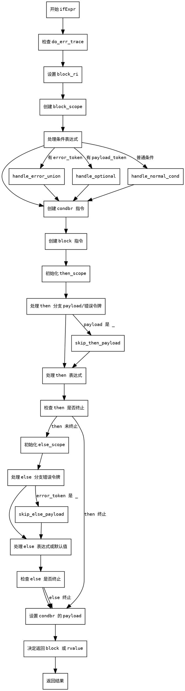

嗯，我需要为这个Zig函数`ifExpr`画一个流程图。首先，我得仔细理解这个函数的结构和逻辑。这个函数处理的是if表达式，生成ZIR指令。看起来函数里有很多条件分支，比如处理错误联合、可选类型、不同的作用域等等。

首先，函数开始部分，检查是否有错误跟踪（`do_err_trace`），然后处理结果位置（`need_rl`和`block_ri`）。接下来创建`block_scope`，然后处理条件表达式，根据是否有错误令牌或payload令牌生成不同的条件判断指令。之后，创建条件分支`condbr`，然后生成`block`指令，并设置块体。

接下来是处理then分支，根据是否有payload或错误令牌，创建不同的作用域，可能包含局部变量和调试信息。然后处理then的表达式，检查是否有未使用的变量，如果没有终止指令的话，添加break到block。

然后是处理else分支，同样需要考虑错误跟踪的保存和恢复，处理else表达式，同样添加break到block，最后设置条件分支的payload。

最后，根据是否需要结果右值，返回相应的值。

画流程图的时候，我需要把这些步骤按顺序排列，注意条件分支的走向，比如处理不同情况的then和else部分。可能需要用菱形表示条件判断，矩形表示处理步骤，箭头连接各个步骤，注意循环和分支的流向。还要注意各个子块的作用域，如`block_scope`、`then_scope`、`else_scope`的创建和结束。

可能需要将整个流程分为几个主要部分：初始化、条件处理、then分支处理、else分支处理、合并结果。每个部分中的子步骤也需要详细展开，特别是那些有条件的部分，比如是否有payload或错误令牌，是否生成不同的指令等。

另外，要注意函数中的错误处理，比如`try`的使用可能会影响流程，但因为是生成ZIR指令，可能不需要在流程图中显示错误路径，除非有显式的错误处理步骤。需要确认是否有错误返回的分支，但根据代码中的`InnerError!Zir.Inst.Ref`返回类型，函数可能返回错误，但在流程图中可能不需要特别处理，除非有显式的错误检查。

现在，我需要将这些逻辑步骤转化为Graphviz的节点和边，确保每个条件分支正确连接，处理then和else的不同情况，并正确合并到最终的结果返回。
================================================
