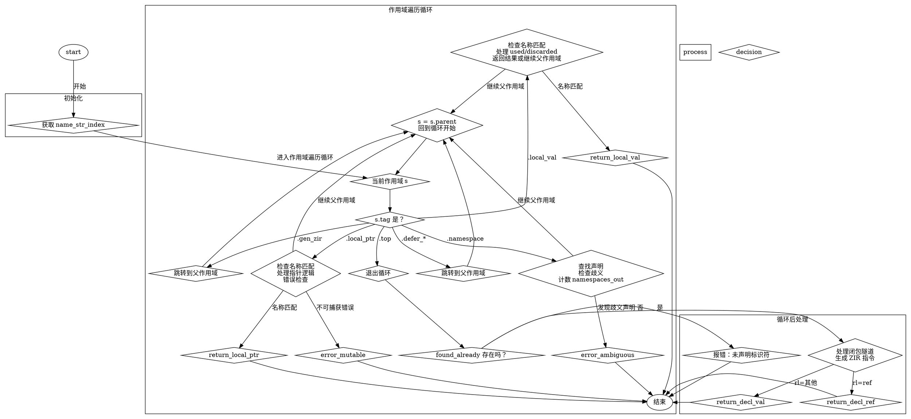

嗯，我需要为这个Zig函数`localVarRef`画一个流程图。首先，我得理解这个函数的结构和逻辑。函数看起来是在处理局部变量的引用，可能是在生成ZIR（Zig Intermediate Representation）的过程中。让我先大致看一下代码的结构。

函数开始定义了一些变量，比如`astgen`、`name_str_index`，然后进入一个循环，遍历不同的作用域（scope）。作用域有不同的类型，比如`.local_val`、`.local_ptr`、`.gen_zir`等，每种类型有不同的处理逻辑。比如，在`.local_val`中，检查名称是否匹配，处理使用或丢弃的情况，可能需要通过闭包隧道（tunnelThroughClosure）。类似的，`.local_ptr`处理指针，检查是否可变，处理不同的右值上下文（rl）。

然后，当作用域是`.namespace`时，查找声明，处理可能的歧义引用。如果没找到声明，报错未声明的标识符。最后根据不同的情况生成不同的ZIR指令，比如`.decl_ref`或`.decl_val`。

接下来，我需要将这个过程转化为流程图。流程图通常包括开始、结束、判断节点、处理步骤等。这里有几个主要的循环和条件分支，比如`while (true)`循环，内部根据作用域类型进行不同的处理。每个作用域类型可能有不同的逻辑分支，比如找到匹配的局部变量、处理指针、处理命名空间中的声明等。

需要注意的是，函数中有多个返回点，需要确保每个分支都正确连接到结束节点。此外，错误处理部分（如`astgen.failNode`）也需要在流程图中体现。

可能的步骤：
1. 开始节点：函数开始。
2. 初始化变量，如获取`name_str_index`。
3. 进入作用域遍历循环，处理不同的作用域类型。
4. 每个作用域类型对应的处理逻辑，可能包括条件判断（如名称匹配、是否可丢弃等）。
5. 如果找到匹配的作用域变量，处理并返回相应结果。
6. 如果遍历完所有作用域未找到，检查`found_already`是否为null，报错未声明标识符。
7. 处理找到的声明，考虑是否需要通过闭包隧道，生成相应的ZIR指令。
8. 根据`ri.rl`的类型（ref或其他），返回不同的结果。

需要特别注意循环中的退出条件，当`s.tag`是`.top`时，循环终止。此外，处理命名空间时的歧义检查和错误提示也需要在流程图中表示。

可能的结构：
- 开始
- 初始化name_str_index
- 进入循环，遍历作用域
  - 分支：作用域类型
    - .local_val: 检查名称，处理使用/丢弃，返回结果
    - .local_ptr: 类似，处理指针相关逻辑
    - .gen_zir, .defer...: 继续父作用域
    - .namespace: 处理声明，检查歧义
    - .top: 退出循环
- 退出循环后检查found_already
  - 如果null，报错未声明
  - 否则处理声明，生成ZIR指令
- 返回结果

错误处理节点需要连接到相应的判断分支，比如在`.local_ptr`中检查是否可捕获，否则报错。

现在，我需要将这些步骤转化为Graphviz的节点和边，使用正确的判断和箭头方向。可能需要使用菱形节点表示判断，矩形节点表示处理步骤，椭圆形表示开始和结束。

可能需要将循环展开，或者用条件分支表示循环内的处理。由于Graphviz不支持循环结构，需要用条件判断和箭头来模拟循环流程。

例如，循环开始后，根据`s.tag`的不同进入不同的处理分支，处理完后指向下一个`s = parent`，然后回到循环开始的条件判断。

对于错误情况，如报错未声明，直接指向结束节点或错误处理节点。

总之，流程图需要清晰展示函数中的控制流，包括所有可能的分支和返回点。
================================================

这个流程图通过以下步骤展示函数逻辑：
1. **初始化**：获取标识符的字符串索引
2. **作用域遍历循环**：
   - 根据作用域类型分支处理
   - 对`.local_val`和`.local_ptr`进行名称匹配检查
   - 处理命名空间中的声明歧义检查
   - 遇到`.top`作用域时退出循环
3. **后处理阶段**：
   - 检查是否找到声明
   - 处理未声明错误或生成最终ZIR指令
4. **错误处理**：在多个分支中处理不同类型的编译错误

箭头方向表示程序执行流程，菱形节点表示条件判断，矩形节点表示具体操作步骤，椭圆形表示开始/结束节点。