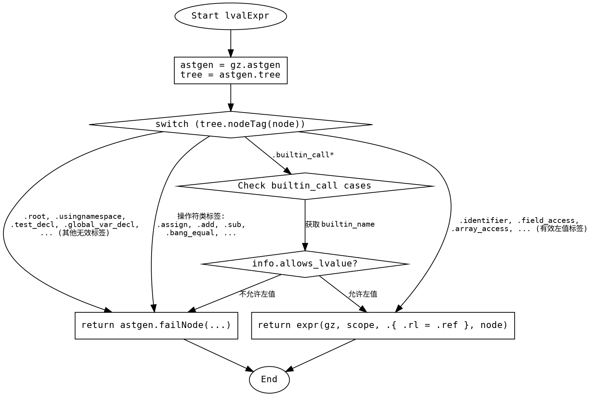

好的，我现在需要为给定的Zig函数`lvalExpr`绘制一个流程图。首先，我需要理解这个函数的结构和逻辑。

函数的主要逻辑是一个大的switch语句，处理不同的节点标签（node tags）。根据不同的标签，函数可能会返回错误，或者继续处理表达式。具体来说：

1. 函数首先获取`astgen`和`tree`，然后根据`node`的标签进行判断。
2. 对于很多标签（如`.root`, `.usingnamespace`等），直接`unreachable`或者返回错误，提示左值无效。
3. 对于某些特定的标签（如各种赋值操作符、算术运算、比较操作符等），同样返回错误。
4. 对于`.builtin_call`及其变种，会检查内置函数是否允许左值，不允许则返回错误。
5. 最后一部分标签（如`.identifier`, `.field_access`等）被认为是有效的左值，继续处理表达式。

接下来，我需要将这些逻辑步骤转化为流程图的结构。流程图应该包括开始、判断节点、处理不同情况的分支，以及结束点。

需要注意以下几点：
- 使用正确的图形符号：矩形框表示处理步骤，菱形表示判断，圆形可能用于开始/结束。
- 确保所有分支都被覆盖，特别是那些导致错误返回的情况。
- 处理`.builtin_call`时需要额外的判断步骤，检查内置函数是否允许左值。
- 最后的有效左值情况会调用`expr`函数并返回其结果。

可能的结构如下：
1. 开始节点。
2. 获取`astgen`和`tree`。
3. 进入switch判断。
4. 对于各个case分支，判断是否返回错误或继续。
5. 对于`.builtin_call`系列，检查内置函数名称，决定是否返回错误。
6. 有效左值情况下调用`expr`函数。
7. 结束节点。

需要确保每个分支都有正确的流向，特别是错误处理和正常流程的区分。此外，需要处理所有列举的标签，但为了简化流程图，可以将多个返回错误的情况合并为一个节点，说明这些标签直接导致错误。

现在，我需要将这些步骤用Graphviz的DOT语言表示出来。确保节点之间的连接正确，逻辑清晰。
================================================
