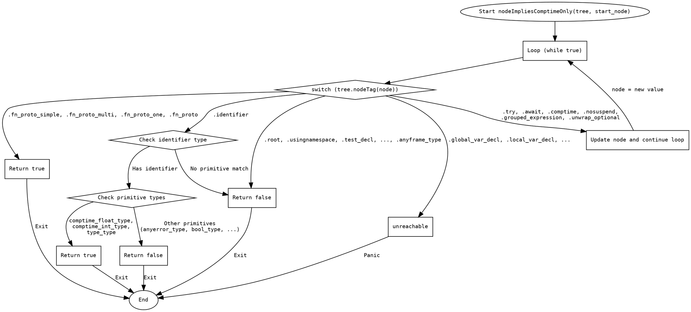

嗯，我需要为给定的Zig函数`nodeImpliesComptimeOnly`绘制一个流程图。首先，我得理解这个函数的结构和逻辑。函数的主要部分是一个无限循环，根据不同的节点标签执行不同的操作。大部分情况返回`false`，某些情况返回`true`，还有一些情况会修改`node`变量，继续循环。

首先，我需要确定函数的主要分支。函数使用了一个大的`switch`语句来处理不同的节点标签。对于每个标签，可能有三种处理方式：返回`false`、返回`true`，或者更新`node`并继续循环。此外，`.identifier`标签有一个更复杂的处理逻辑，需要检查标识符是否是特定的原始类型。

接下来，我需要将这些逻辑分支转化为流程图的结构。通常，流程图包括开始、判断节点、操作节点和结束节点。这里，开始节点是函数的入口，然后进入一个循环，根据不同的节点标签分支到不同的处理路径。

需要注意的是，`.identifier`的情况需要进一步检查标识符的内容，这会形成一个子判断流程。此外，那些导致`node`更新的情况会回到循环的开始，继续处理新的`node`值。

可能遇到的困难是如何简洁地表示大量的`switch`分支。在流程图中，可能需要将这些分支分组，例如将所有返回`false`的标签归为一类，返回`true`的归为另一类，而那些更新`node`的则形成循环路径。

另外，要确保流程图的正确性，需要准确反映函数的控制流。例如，当遇到某些标签时，函数会立即返回，而其他标签会导致循环继续。需要特别注意这些不同的出口点。

最后，使用Graphviz的DOT语言来绘制流程图。每个判断节点用菱形表示，操作用矩形，箭头表示流程方向。可能需要将多个标签合并到一个判断节点中，以简化图表，同时保持可读性。

总结步骤：
1. 确定函数的主循环结构。
2. 分类处理不同的节点标签，归为返回`false`、返回`true`、更新`node`三类。
3. 处理`.identifier`的特殊情况，包含子判断。
4. 将上述逻辑转换为Graphviz的节点和边。
5. 确保流程正确，没有遗漏分支。
================================================

这个流程图展示了以下逻辑流程：
1. 函数入口进入主循环
2. 根据不同的AST节点标签进行分支判断：
   - 遇到特定标签直接返回false
   - 遇到函数原型相关标签返回true
   - 遇到需要继续解析的标签时更新node并继续循环
   - 遇到标识符时需要进一步检查原始类型
   - 遇到不可达的标签会触发panic
3. 所有路径最终都会到达结束节点

节点形状说明：
- 椭圆：开始/结束节点
- 菱形：条件判断
- 矩形：具体操作
- 箭头上的标签表示触发该路径的条件