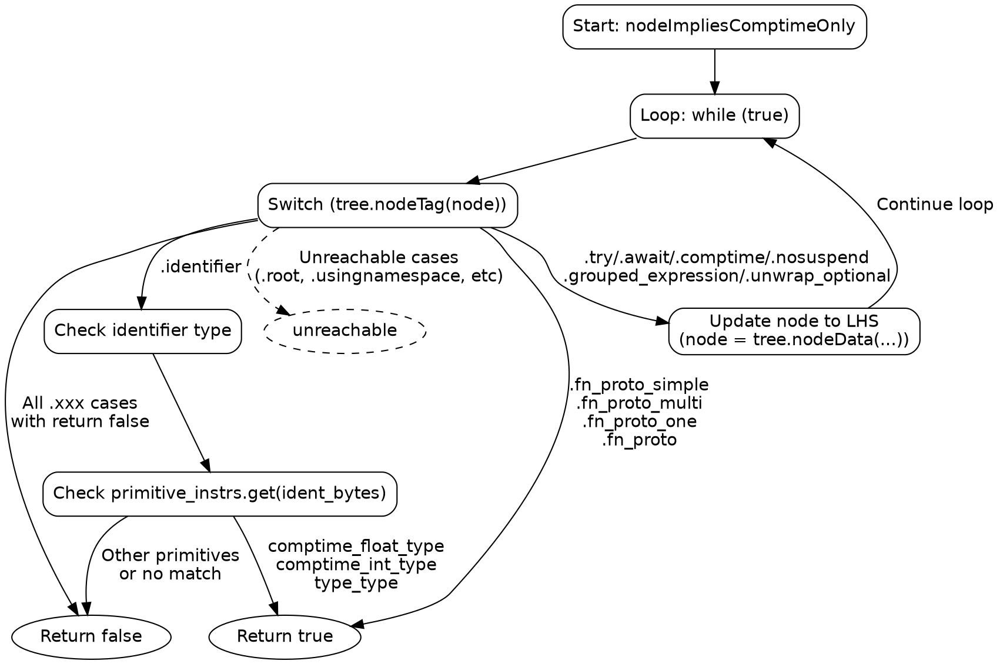

嗯，用户让我用Graphviz来画这个Zig函数nodeImpliesComptimeOnly的流程图。首先，我需要理解这个函数的结构和逻辑。

函数的主要部分是一个无限循环，里面有一个大的switch语句，处理不同的节点类型。每个case决定是返回true、false，还是继续循环处理子节点。比如，遇到.@"comptime"这样的节点，会更新node变量并继续循环。而像.identifier的情况，会根据标识符的内容返回不同的布尔值。

接下来，我需要将这个过程转化为流程图的结构。流程图的开始是函数入口，然后进入循环。每个switch的分支对应不同的处理路径。需要注意循环中的break和continue，但在这个函数里，循环是通过while(true)实现的，退出条件只有return语句。

对于每个case，需要判断是直接返回还是继续处理子节点。例如，当遇到.@"try"时，会设置node为子节点，然后回到循环开始。而.identifier的情况可能需要多个分支，比如检查标识符是否为某些特定类型，然后返回对应的结果。

另外，需要注意那些直接返回true或false的case，以及那些导致循环继续的case。比如，在.identifier的处理中，如果标识符是comptime_float_type，则返回true，否则返回false。

可能的结构是：开始节点 -> 循环判断 -> 处理当前节点 -> 根据节点类型分支到不同的处理路径，每个路径最终指向返回或继续循环。需要将每个case的处理逻辑正确映射到流程图的节点和边。

可能遇到的挑战是处理大量的case分支，需要合理组织，避免图表过于复杂。可能需要将多个返回false的case合并为一个节点，而将返回true的单独处理。对于需要继续循环的情况，用箭头指回循环开始节点。

最后，确保所有的路径都被覆盖，没有遗漏的case，并且流程图的结构清晰，符合Graphviz的语法。
================================================

这个流程图使用Graphviz的DOT语言绘制，展示了：

1. 函数入口点
2. 主循环结构
3. 主要switch分支
4. 处理不同节点类型的逻辑流：
   - 直接返回false的节点类型（合并表示）
   - 直接返回true的函数原型节点
   - 需要继续递归处理子节点的控制流节点
   - 标识符节点的特殊处理流程
   - 不可达节点的特殊标记

箭头方向表示程序执行流程，菱形节点表示判断/分支点，椭圆形节点表示终止状态，虚线表示不可达代码路径。