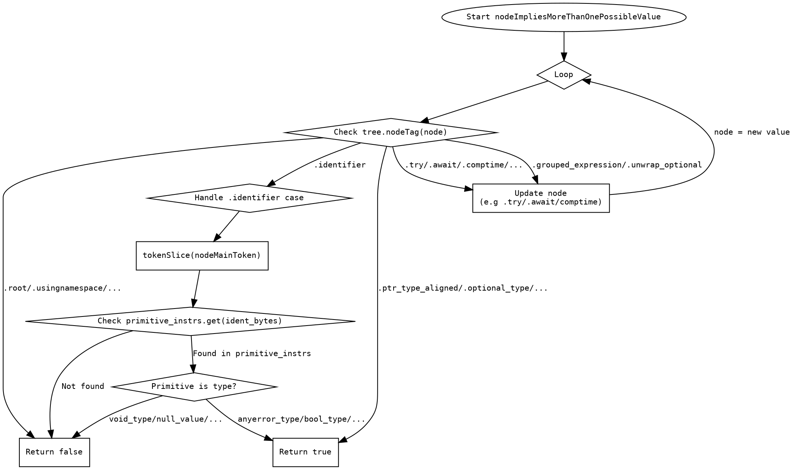

好的，我需要为给定的Zig函数`nodeImpliesMoreThanOnePossibleValue`绘制一个Graphviz流程图。首先，我需要理解这个函数的结构和逻辑。

函数的主要结构是一个无限循环，内部有一个大的switch语句，根据不同的节点标签执行不同的操作。大多数情况下，遇到特定标签时返回false，某些标签返回true，还有一些标签会改变当前节点并继续循环，或者进入其他处理逻辑，比如处理标识符的情况。

首先，我需要确定流程图的主要部分：

1. **入口点**：函数开始，进入循环。
2. **循环结构**：无限循环，每次处理当前节点。
3. **Switch分支处理**：
   - 直接返回false的情况（众多标签）。
   - 返回true的情况（如ptr类型相关标签）。
   - 修改当前节点并继续循环的情况（如try、await、comptime等）。
   - 处理标识符的情况，检查是否是特定原始类型，返回true或false。
4. **退出点**：返回true或false。

接下来，我需要考虑如何将这些逻辑转换为流程图节点和边。需要注意的是，有些分支会导致直接返回，而有些会导致循环继续。

在处理标识符的部分，存在多个条件判断，可能需要子流程或者多个判断节点。例如，检查标识符是否是某个原始类型，如果是则返回true，否则返回false。

需要注意的是，Graphviz使用DOT语言，节点用形状表示，边表示流程走向。可能需要使用菱形表示判断节点，矩形表示处理步骤，椭圆形表示开始和结束。

可能的流程步骤：

1. 开始节点。
2. 进入循环。
3. 检查当前节点的标签。
4. 根据不同的标签分支到不同的处理：
   - 返回false。
   - 返回true。
   - 更新节点并回到循环开始。
   - 处理标识符。
5. 处理标识符时，检查是否为特定原始类型，决定返回true或false。

需要注意循环结构在流程图中的表示，可能需要使用边连接回到循环开始的位置。

此外，需要确保所有可能的路径都被覆盖，特别是那些在switch中未明确列出但通过`unreachable`处理的标签，这些可能在流程图中表示为终止节点或错误处理。

最后，将所有部分整合成一个完整的Graphviz图，确保节点和边的正确连接，避免循环错误。
================================================
