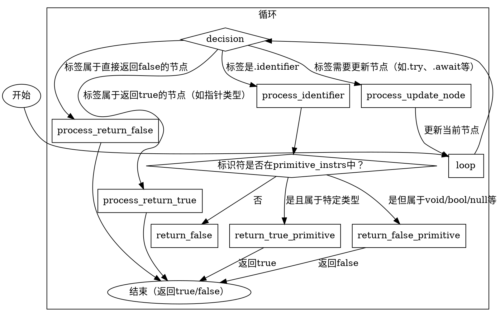

好的，我现在需要帮用户用Graphviz画出这个Zig函数的流程图。首先，我得仔细看看这个函数的代码，理解它的逻辑结构。这个函数名为nodeImpliesMoreThanOnePossibleValue，看起来是检查某个AST节点是否隐含多个可能的值。

函数的大致结构是一个无限循环，通过不断检查当前节点的标签（tag）来决定下一步操作。大部分情况下，当节点属于某些特定标签时，函数会返回false或者true。有些情况下，比如遇到.try、.await等节点，会更新当前节点到其子节点，继续循环。还有一些情况，比如.identifier，会进一步检查标识符的类型，再决定返回true还是false。

接下来，我需要将这些逻辑转化为流程图。流程图通常包括开始、结束、判断节点和处理步骤。这个函数的核心是一个大的switch语句，每个case对应不同的处理逻辑。因此，流程图需要涵盖这些判断分支。

首先，流程图的开始点是函数入口，然后进入一个循环。循环内部是一个switch节点。根据不同的标签，处理方式不同：

1. 某些标签直接导致函数返回false，例如.root、.usingnamespace等，这些需要连接到返回false的端点。
2. 有些标签如.try、.await会让节点指向子节点，继续循环，这里需要一个箭头指回循环开始。
3. 遇到.ptr_type_aligned等标签时返回true，需要连接到返回true的端点。
4. .identifier的情况比较复杂，需要检查标识符是否在primitive_instrs中，并根据不同的primitive类型返回true或false。这里可能需要一个子判断流程。

需要注意循环的终止条件。每次循环都会处理当前节点，直到遇到返回语句或者无限循环被打破。不过根据代码结构，循环内部的所有分支都会有返回或更新节点继续循环，所以理论上不会无限循环。

可能的挑战是如何将复杂的switch结构简化为清晰的流程图，避免过于复杂。需要将多个case分组，比如将所有直接返回false的case合并为一个判断分支，同样处理返回true的情况。对于.identifier的情况，可能需要单独的分支，内部再进行细分。

此外，函数中有些标签会导致节点更新，例如node = tree.nodeData(node).node，这部分需要表示为循环中的箭头，重新指向循环开始。

总结步骤：
1. 开始节点。
2. 进入循环。
3. 判断当前节点的标签。
4. 根据标签分支到不同的处理：
   - 直接返回false。
   - 更新节点并继续循环。
   - 返回true。
   - 处理.identifier的特殊情况。
5. 结束节点（返回true或false）。

在绘制时，可以使用不同的形状表示不同操作，如菱形表示判断，矩形表示处理步骤，椭圆形表示开始和结束。对于.identifier中的子判断，可能需要嵌套的判断结构。

现在，我需要将这些逻辑用Graphviz的DOT语言表示出来。需要定义各个节点，并用箭头连接它们，标明条件。可能需要对一些case进行合并，以简化图形。例如，将多个返回false的case合并为一个“返回false”节点，同样处理返回true的情况。

最后，需要检查流程图是否覆盖了所有可能的分支，特别是那些容易遗漏的case，比如.identifier中的各种primitive类型判断。
================================================

### 流程图说明：
1. **开始节点**：函数入口。
2. **循环结构**：
   - **判断节点**：根据当前AST节点的标签进行分支。
   - **直接返回false**：处理`.root`、`.usingnamespace`等标签。
   - **更新节点**：处理`.try`、`.await`等标签，更新当前节点后继续循环。
   - **返回true**：处理指针类型（如`.ptr_type_aligned`）等标签。
3. **标识符特殊处理**：
   - 检查标识符是否在`primitive_instrs`中：
     - **返回true**：若为`anyerror_type`、`comptime_int_type`等。
     - **返回false**：若为`void_type`、`bool_true`等。
     - **默认返回false**：若不在`primitive_instrs`中。
4. **结束节点**：统一返回结果。

通过此图可清晰看出函数的逻辑分支和循环结构，尤其对AST节点标签的多级判断和标识符的特殊处理进行了分层展示。