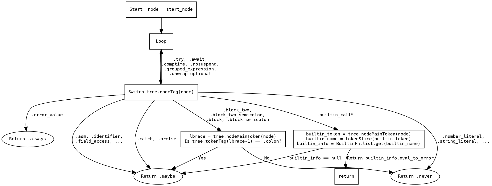

嗯，我现在需要画这个函数的流程图。首先，我得理解这个函数是做什么的。看起来这个函数叫做nodeMayEvalToError，接收一个AST树和一个起始节点，然后返回一个枚举值，可能是.always、.maybe或者.never，表示该节点是否可能求值出错。

函数里面有一个while循环，不断地检查当前节点的标签，然后根据不同的标签做不同的处理。比如，某些标签会直接返回.always，比如.error_value；有些返回.maybe，比如.@"asm"、.identifier等等；还有一些返回.never，比如.number_literal、.string_literal等等。还有一些情况会改变当前节点，继续循环，比如.@"try"、.@"await"这些，会把node设置成它们的子节点。还有一些特殊情况，比如处理block的情况，可能需要检查前面的token是否是冒号来决定返回什么。

好的，流程图应该从函数入口开始，然后进入循环，每次处理当前节点。每个case对应不同的处理路径，可能需要不同的判断分支。比如，遇到某些节点直接返回，有些则继续循环，有些需要进一步的判断，比如检查token是否是冒号，或者检查内置函数的信息。

我需要考虑如何将这些逻辑用graphviz的流程图表示出来。可能需要开始节点，然后进入循环，每个switch的分支对应不同的决策框或者处理步骤。例如，当节点是.error_value时，直接指向返回.always的节点；如果是.try或.await，则指向更新节点并继续循环的步骤；如果是block类型，则需要判断前一个token是否是冒号，从而分支出不同的返回结果。

需要注意循环的结构，因为每次处理节点后可能会继续循环，或者直接返回。另外，处理内置函数的部分可能需要调用BuiltinFn.list.get，这里的结果会影响返回的eval_to_error，所以这部分需要作为判断条件。

可能的结构是这样的：开始 -> 进入循环 -> 判断节点标签 -> 根据不同标签处理 -> 返回结果或继续循环。需要将每个case对应的处理步骤用不同的节点和箭头连接起来，确保流程正确。

另外，注意一些case会触发循环继续，比如设置node为子节点后继续循环。这时候流程图中应该有箭头指回循环的开始部分。

可能需要将switch中的各个情况分组，比如哪些直接返回，哪些继续循环，哪些需要进一步判断。这样流程图会更清晰。例如，处理到block类型时，进入一个判断前一个token是否是冒号的子流程，然后根据结果返回.maybe或.never。

还有处理builtin_call的情况，需要检查builtin_name，然后根据是否存在对应的builtin_info来决定返回结果。这部分可以表示为判断是否存在builtin_info，如果是则返回其eval_to_error，否则返回.maybe。

总之，流程图需要覆盖所有可能的case，并且正确表示出逻辑分支和循环结构。可能需要将每个主要的switch case作为一个决策节点，并连接相应的处理步骤和返回结果。
================================================

该流程图使用Graphviz的DOT语言表示，主要特点：

1. 使用矩形节点表示处理步骤，椭圆形表示终止状态
2. 用不同分支处理switch中的不同case：
   - 直接返回.always/.maybe/.never的情况
   - 需要继续循环的情况（修改node后回到loop节点）
   - 需要二次判断的情况（带标签的block和builtin_call）
3. 特殊处理block类型时检查前导冒号
4. 处理builtin_call时检查内置函数有效性
5. 箭头上的标签明确标注了对应的AST节点类型或判断条件

关键路径说明：
- 函数入口后进入循环处理节点
- 通过switch分发到不同处理逻辑
- 部分节点需要二次条件判断（菱形节点）
- 内置函数调用需要额外查询BuiltinFn列表
- 修改node的操作会回到循环开始继续处理新节点