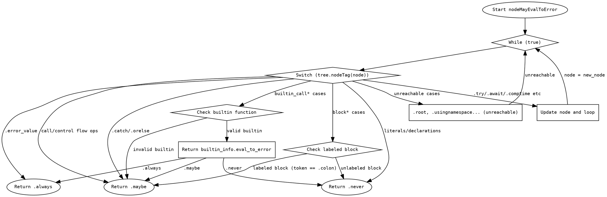

嗯，我现在需要帮用户用Graphviz画出一个Zig函数`nodeMayEvalToError`的流程图。首先，我得仔细看看这个函数的代码结构。函数里面有一个while循环，不断处理不同的节点类型，然后返回不同的结果，比如.always、.maybe、.never，或者继续处理子节点。

首先，我需要理清函数的逻辑结构。函数开始于一个while(true)循环，里面是一个大的switch语句，处理各种节点标签（nodeTag）。每个case处理不同的情况，有些直接返回结果，有些则会修改当前节点（node = ...），然后继续循环。还有一些情况会进入条件判断，比如block_two或builtin_call的情况，这时候需要根据特定条件返回不同的结果。

接下来，我需要确定如何将这些逻辑转化为流程图。流程图通常包括开始、结束节点、判断节点、处理步骤和箭头连接。这里的关键是处理switch中的各个分支。每个case可以看作一个判断或处理步骤。由于有很多不同的节点标签，可能需要将它们分组，或者用条件判断框来表示不同的分支。

首先，流程图应该有一个开始节点，然后进入循环。循环内部是switch的判断。对于每个case，如果是直接返回（比如return .always），则连接到相应的结束节点。如果是修改node并继续循环，则需要箭头指回循环开始。对于需要进一步判断的情况，比如block_two中的判断token是否为冒号，需要添加条件判断节点。

需要注意的是，有些情况会直接返回，而有些则会导致循环继续。例如，在.@"try"、.@"await"等情况下，node会被更新，然后循环重新开始。而像.builtin_call则需要进一步判断内置函数的名称，根据不同的内置函数决定返回值。

可能的结构是：

1. 开始节点。
2. 进入循环，判断节点类型。
3. 根据不同的节点标签分支到不同的处理逻辑。
4. 对于每个处理逻辑，如果是返回，则指向对应的返回节点（.always、.maybe、.never）。
5. 如果是更新node并继续，则箭头指回循环开始。
6. 对于需要额外条件判断的情况（如block_two中的lbrace检查），添加条件判断节点，再根据结果分支。

另外，需要考虑如何处理大量的case分支。为了简化流程图，可以将具有相同返回结果或相似处理逻辑的case合并。例如，所有返回.maybe的case可以合并为一个分支，同样处理返回.never或.always的情况。

对于像.builtin_call的处理，需要展开子流程：检查builtin_token，获取名称，查找BuiltinFn.list，根据结果返回不同的eval_to_error。这部分可能需要单独的子判断流程。

可能遇到的困难是处理循环中的node更新，以及如何表示switch中的多个case。另外，确保所有可能的路径都被覆盖，没有遗漏的分支。

总结步骤：

1. 确定所有可能的出口：三个返回结果（always, maybe, never）。
2. 分析每个case的处理流程，归类到不同的出口或循环继续。
3. 设计流程图的结构，包括循环、判断节点、处理步骤和连接线。
4. 使用Graphviz语法绘制流程图，用节点和边表示各个步骤和判断。

在绘制时，可能需要使用子图来组织复杂的判断逻辑，例如将switch的各个case分组。但Graphviz的语法中，子图主要用于视觉分组，不影响布局。因此，可能需要用不同的颜色或形状来区分不同类型的节点，例如判断节点用菱形，处理步骤用矩形，返回节点用椭圆形。

现在开始尝试用Graphviz编写这个流程图的结构。需要注意的是，由于代码中有大量case，可能需要简化表示，例如将多个case合并为一个判断框，或者用注释说明多个情况处理相同的结果。
================================================

### 流程图说明：
1. **开始节点**进入主循环
2. 通过`switch`语句判断节点类型：
   - 遇到不可达节点直接终止流程
   - `.error_value`直接返回`.always`
   - 函数调用/控制流操作返回`.maybe`
   - 字面量/声明类节点返回`.never`
   - 特殊操作符（try/await等）更新节点继续循环
3. **块语句**需要额外检查是否为带标签的块：
   - 带标签的块可能产生错误（返回`.maybe`）
   - 普通块不会产生错误（返回`.never`）
4. **内置函数调用**需要二次检查：
   - 无效内置函数默认返回`.maybe`
   - 有效内置函数根据其属性返回对应结果

该流程图通过条件分支清晰展示了：
- 所有立即返回的节点类型
- 需要递归处理的表达式类型
- 需要额外语义检查的特殊语法结构
- 内置函数调用的特殊处理逻辑

使用标准流程图符号：
- 椭圆：开始/结束节点
- 菱形：条件判断
- 矩形：处理步骤
- 箭头：控制流方向