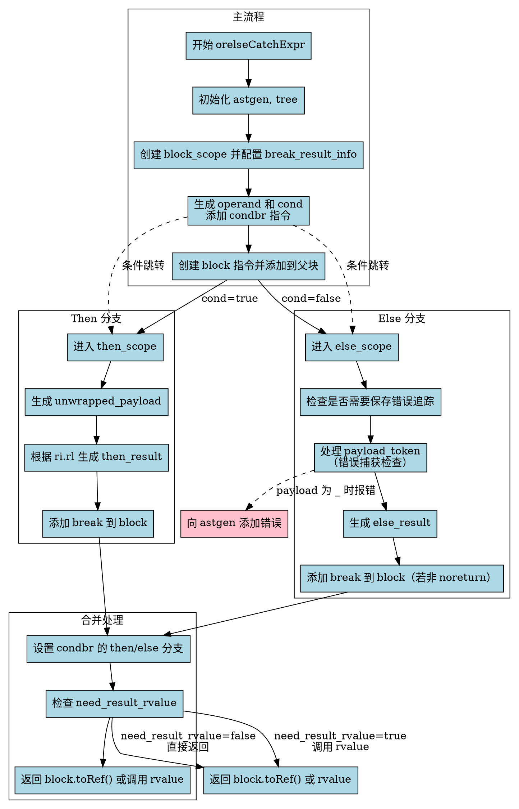

嗯，我需要画这个函数的流程图。首先，我得仔细读这个函数的代码，理解它的逻辑结构。这个函数的名字是orelseCatchExpr，看起来是处理Zig中的orelse和catch表达式的AST生成。

首先，函数接收一些参数，比如parent_gz、scope、ri、node等。里面有很多条件判断和分支，比如根据不同的条件生成不同的操作码，处理不同的作用域块。比如有block_scope、then_scope、else_scope这些子作用域。

接下来，函数里有很多步骤，比如创建子块block_scope，处理操作数operand，添加条件分支condbr，然后处理then分支和else分支。在else分支里，可能还会处理错误捕获的情况，比如检查payload_token是否为null，处理错误名称等。

我需要理清楚每个步骤之间的流程，包括条件判断、循环、子块的创建和结束、break语句的处理，以及最后的返回值是否需要rvalue转换。

可能需要将整个流程分解成几个主要部分：

1. 初始化部分，获取astgen、tree等。
2. 处理block_scope的创建和配置。
3. 生成operand和cond，添加条件分支。
4. 处理then分支，生成unwrapped_payload和then_result，添加break。
5. 处理else分支，包括可能的错误追踪和错误捕获的处理，生成else_result，添加break。
6. 设置条件分支的payload，检查是否需要rvalue转换，返回结果。

注意各个子块的作用域开始和结束的位置，比如block_scope、then_scope、else_scope的创建和unstack。还有错误处理相关的部分，比如do_err_trace的判断，这可能影响流程中的某些步骤。

画图时，需要将这些步骤用节点表示，并用箭头连接顺序和条件分支。比如，condbr会根据cond的值跳转到then或else分支。每个分支处理完毕后，合并到block中，最后根据need_result_rvalue决定返回值。

可能还需要处理一些特殊情况，比如payload_token是否为_，这时候需要报错。或者处理错误捕获时的本地变量遮蔽检查等。

总之，流程图应该从函数入口开始，逐步展示各个步骤和条件分支，直到最后的返回。确保每个条件判断都有对应的分支路径，并正确连接各个子块的处理流程。
================================================
