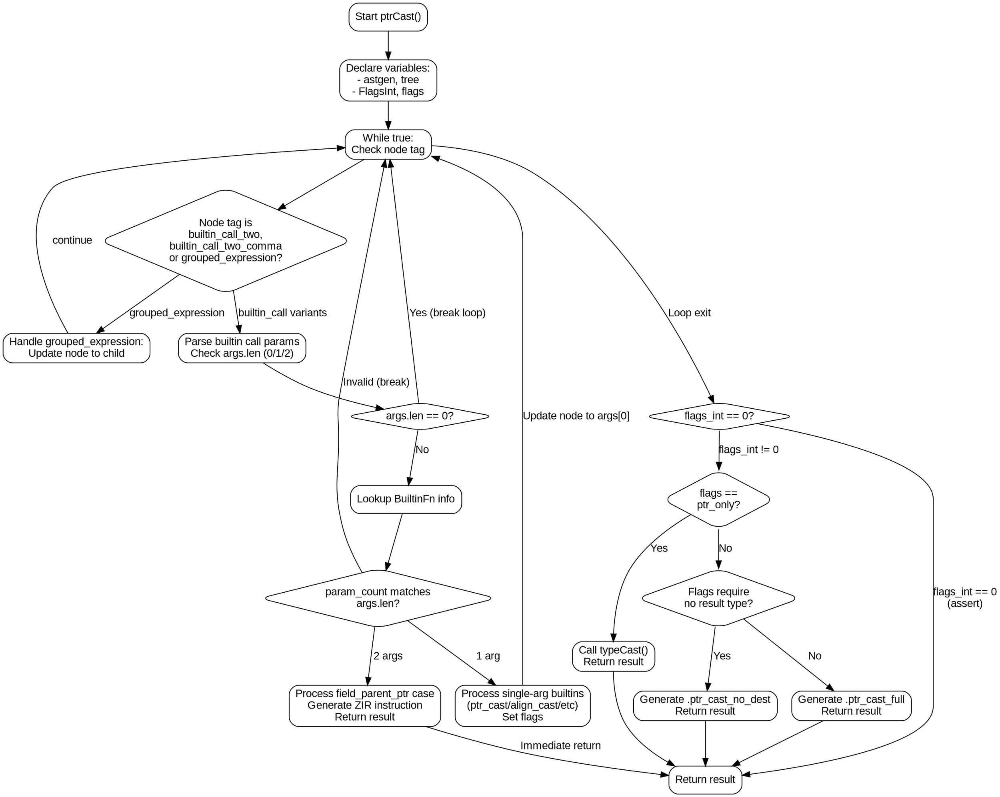

嗯，我需要为提供的Zig函数`ptrCast`绘制一个流程图。首先，我得仔细阅读代码，理解每个步骤的逻辑流程。函数的主要目的是处理指针转换相关的内置函数调用，并根据不同的参数和标志生成相应的ZIR指令。

首先，函数开始处声明了一些变量，比如`astgen`、`tree`、`FlagsInt`和`flags`。接着进入一个while循环，处理可能存在的嵌套节点，比如分组表达式。然后根据节点的标签（如`.builtin_call_two`或`.builtin_call_two_comma`）处理不同的内置函数调用参数。

在处理参数时，函数检查参数的数量和类型，根据不同的内置函数标签（如`.ptr_cast`、`.align_cast`等）设置相应的标志位。如果遇到`.field_parent_ptr`这种情况，会处理两个参数，并生成特定的ZIR指令。

之后，函数会根据设置的标志位判断是否需要特殊处理，比如简单的指针转换或不需要结果类型的转换。最后，根据不同的情况生成相应的ZIR指令并返回结果。

在绘制流程图时，需要注意各个条件分支，比如循环处理节点、参数数量检查、内置函数标签的判断，以及不同标志位组合导致的不同处理路径。每个判断点都需要一个菱形决策节点，不同的路径用箭头连接，处理步骤用矩形框表示。

需要注意的是，函数中有多个可能的退出点，比如在参数数量不匹配或内置函数不识别时跳出循环，或者在处理`.field_parent_ptr`时直接返回结果。这些都需要在流程图中明确标出。

另外，函数末尾的几个条件分支（如特殊情况的处理、是否需要结果类型等）也需要详细展示，确保每个逻辑分支都被正确表示。最后，确保所有路径最终汇聚到函数的结束点，或者相应的返回语句。
================================================
