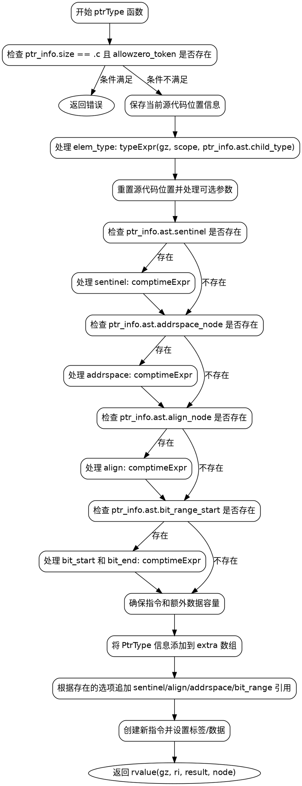

好的，我需要为给定的Zig函数`ptrType`绘制一个流程图。首先，我需要理解这个函数的结构和逻辑流程。

首先，函数开始检查`ptr_info.size`是否为`.c`并且`allowzero_token`是否存在。如果条件满足，返回错误。接下来，保存当前的源代码位置信息，然后处理`elem_type`。

然后，处理各种可能的选项：sentinel、addrspace、align、bit_range。每个选项都可能存在，需要分别处理。每个处理步骤都会重置源代码位置，并生成相应的引用，同时增加`trailing_count`。

之后，函数确保有足够的容量来添加新的指令和额外数据。接着，将`PtrType`的信息添加到`extra`数组中，并根据存在的选项追加相应的引用。

最后，创建新的指令，设置其标签和数据，并将结果返回。

接下来，我需要将这些步骤转化为流程图。流程图应包含开始和结束节点，条件判断（如检查ptr_info.size和allowzero_token），各个处理步骤（如处理sentinel、addrspace等），以及最后的指令生成和返回。

需要注意的是，每个条件判断后的处理步骤可能有多个分支，但在这个函数中，各个选项的处理是顺序进行的，而非嵌套或分支。因此，流程图应顺序展示这些步骤，每个条件判断后执行相应的处理，然后继续下一个步骤。

需要确保流程图的节点正确表示每个操作，包括错误返回点、循环或条件分支，但在此函数中，主要是顺序处理各个可能的选项，所以流程图应反映这一顺序结构。
================================================
