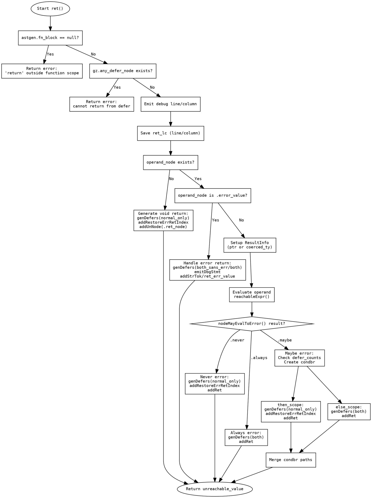

嗯，用户让我用Graphviz来画这个Zig函数的流程图。首先，我需要理解这个函数的结构。这个函数是处理返回语句的，叫ret函数。看起来里面有很多条件判断，比如检查是否在函数作用域内，是否有defer表达式，处理不同的返回类型，错误处理等等。

首先，我应该从函数的入口开始，也就是函数定义fn ret(...)。然后，函数一开始检查astgen.fn_block是否为null，如果是，就返回错误，因为return不能在函数外使用。这应该是一个条件判断节点，导致错误路径。

接下来，检查gz.any_defer_node是否存在，如果存在，返回另一个错误，指出不能在defer中返回。这也是一个条件分支。

然后，处理调试信息的生成，这里可能是一个步骤，不需要分支。接着保存ret_lc的行列信息。

之后，处理operand_node是否存在。如果不存在，说明是返回void，需要执行genDefers并生成对应的ZIR指令。这里可能是一个分支，处理无操作数的情况。

如果有operand_node，需要检查是否是错误值（error_value）。如果是，处理快速路径，生成对应的错误返回指令，并根据是否需要错误代码来分支处理不同的情况。

如果不是错误值，进入常规处理，设置ResultInfo，处理操作数的表达式，根据可能的情况（是否可能返回错误）来生成不同的代码路径。这里有几个情况：从不返回错误、总是返回错误、可能返回错误。每个情况对应不同的处理逻辑，比如生成不同的defer块，条件分支等。

特别是当操作数可能返回错误时，会生成条件分支（condbr），创建then_scope和else_scope，分别处理正常情况和错误情况，执行不同的defer，然后合并流程。

整个函数的结构有很多条件分支和循环，需要将这些逻辑拆分成流程图的节点和边。每个条件判断对应一个菱形节点，然后根据条件的结果分为不同的路径。每个处理步骤用矩形节点表示，结束点用圆形或椭圆形。

需要注意的是，函数中有多个返回点，比如在不同情况下返回Zir.Inst.Ref.unreachable_value，这些应该指向流程图的结束节点。

可能的结构是：

开始 -> 检查fn_block? -> 是的话继续，否则错误。
-> 检查any_defer_node? -> 是的话错误，否则继续。
-> 处理调试信息。
-> 检查operand_node是否存在？无的话处理void返回，否则继续。
-> 检查是否是error_value？是的话处理错误返回路径，否则常规处理。
-> 常规处理中根据是否可能错误分三个分支：从不、总是、可能。
-> 可能错误的情况下生成条件分支，处理then和else块，最后合并到结束。

这需要将这些步骤和分支用Graphviz的节点和边表示，确保逻辑正确，没有遗漏的分支。同时，注意各个子块的处理，比如genDefers的调用，可能需要表示为子流程，但流程图可能需要简化，避免过于复杂。

现在需要将这些步骤转化为Graphviz的dot语法，使用正确的节点形状和箭头连接，确保流程清晰。
================================================
