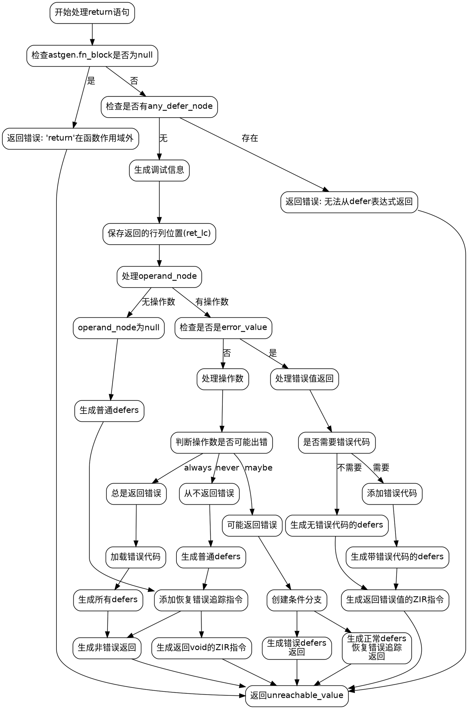

好的，我需要为给定的Zig代码绘制流程图。首先，我需要理解这段代码的功能。这段代码处理函数中的`return`语句生成ZIR（Zig Intermediate Representation）指令的过程。函数`ret`负责处理返回语句，包括错误处理、延迟（defer）语句的执行，以及生成相应的ZIR指令。

首先，我会分析代码的结构，识别出主要的条件分支和循环。例如，代码一开始检查是否在函数作用域外返回，然后处理是否有defer表达式，接着处理返回值的不同情况，比如返回void、错误值、可能出错的值等。

接下来，我需要将每个条件判断和相应的处理步骤转化为流程图的节点和分支。例如：

1. 检查是否在函数作用域外，如果是，返回错误。
2. 检查是否有任何defer节点，如果有，返回错误并提示。
3. 处理调试信息的生成。
4. 处理返回void的情况，生成相应的ZIR指令。
5. 处理返回错误值的情况，生成错误相关的ZIR指令。
6. 处理可能返回错误或正常值的情况，生成条件分支来处理不同的defer情况。

在绘制流程图时，需要注意各个条件之间的逻辑关系，以及每个分支后的处理步骤。例如，当返回的是错误值时，是否需要生成错误代码，如何处理不同的defer类型等。

还需要注意代码中的递归或循环结构，例如`genDefers`函数可能会处理多个defer语句，但在这段代码中，主要通过条件判断来处理不同的defer情况，而不是循环。

最后，确保流程图的每个节点清晰标注，条件分支明确，处理步骤简洁明了，便于理解整个函数的执行流程。
================================================
