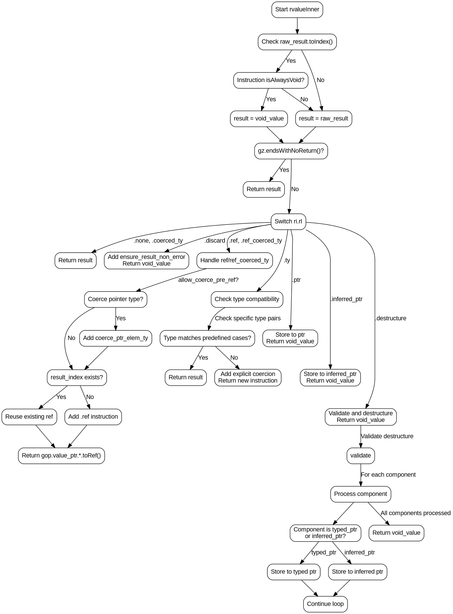

嗯，我需要为这个Zig函数`rvalueInner`绘制流程图。首先，我得理解这个函数的结构和逻辑。让我仔细看一下代码。

函数开始于一个块表达式，用来确定`result`的值。如果`raw_result`可以转换为索引，并且对应的指令是`isAlwaysVoid`，则结果为`void_value`，否则保持原值。接下来，检查`gz`是否以无返回结束，如果是，直接返回`result`。

然后，根据`ri.rl`的不同情况，处理不同的结果位置（Result Location）。这里有多个分支：`.none`, `.coerced_ty`, `.discard`, `.ref`, `.ref_coerced_ty`, `.ty`, `.ptr`, `.inferred_ptr`, `.destructure`。每个分支有不同的处理逻辑。比如，`.discard`会添加一个检查错误的节点，返回`void_value`；`.ref`需要处理指针引用，可能生成`.ref`指令或者复用已有的引用。

在处理`.ty`分支时，首先检查类型是否已经匹配，避免不必要的强制转换。这里有很多具体的类型匹配情况，如果匹配就直接返回原结果，否则生成类型转换指令。`.ptr`和`.inferred_ptr`则涉及到存储值到指针的操作，返回`void_value`。`.destructure`处理解构的情况，验证结构并逐个处理每个组件。

接下来，我需要将这些逻辑步骤转化为流程图。首先确定主要的决策点和分支，比如`ri.rl`的不同枚举值。每个分支内部的具体处理步骤需要分解成不同的流程节点。需要注意循环结构，比如在处理`.destructure`时遍历`components`数组，可能需要循环结构。

可能遇到的挑战是如何简洁地表示复杂的条件判断，比如`.ty`分支中的大量类型匹配。可能需要将这些条件简化为一个判断框，说明存在多个匹配情况，然后根据是否匹配决定是否生成转换指令。

另外，函数中有多个返回点，需要确保所有可能的路径都覆盖到。例如，在`ri.rl`的各个分支中，每个分支都可能返回不同的值或进行不同的操作。

最后，使用Graphviz的节点和箭头来连接这些步骤，确保逻辑清晰，结构合理。
================================================
