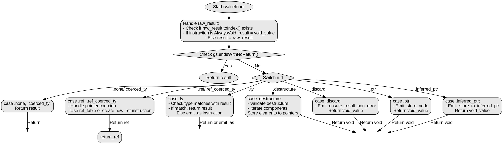

嗯，我现在需要为这个Zig函数rvalueInner画一个Graphviz的流程图。首先，我得先理解这个函数的结构和逻辑流程。函数看起来有点复杂，有很多条件分支和不同的case处理。让我仔细读一遍代码，理清各个分支。

首先，函数rvalueInner接受几个参数，包括gz、ri、raw_result、src_node和allow_coerce_pre_ref，返回一个Zir.Inst.Ref或者错误。函数开始处有一个块r: { ... }，用来处理raw_result的情况。如果raw_result转换成索引后存在，检查对应的指令是否是AlwaysVoid，如果是则返回void_value，否则保持原结果。接着，如果gz以noreturn结束，直接返回结果。

接下来是switch语句，根据ri.rl的不同情况处理。情况包括none、coerced_ty直接返回结果；discard时生成错误检查并返回void；ref和ref_coerced_ty需要处理指针引用，可能生成ref指令；ty情况处理类型强制转换，有很多特定类型的匹配，如果匹配不上则生成类型转换指令；ptr和inferred_ptr处理存储到指针；destructure处理解构赋值，验证并逐个处理组件。

画流程图的时候，需要将每个条件分支和循环结构都表示出来。比如，初始的rvalueInner开始，处理raw_result，然后检查gz是否以noreturn结尾，接着根据ri.rl的不同分支处理。每个case下的具体操作，比如生成指令、处理指针、类型检查等，都需要用不同的节点表示。

需要注意的是，Graphviz使用节点和边来表示流程。每个判断条件对应一个菱形节点，不同分支用箭头指向对应的处理块。处理块用矩形节点，结束点用椭圆。例如，函数开始后，第一个处理是确定result的值，然后检查gz.endsWithNoReturn()，如果是，返回result。否则进入ri.rl的switch分支。

对于每个switch分支，比如ri.rl是discard时，需要生成错误检查指令，然后返回void_value。ref分支则可能生成ref指令，或者使用已有的引用。ty分支有大量的类型匹配，如果匹配成功则返回原结果，否则生成类型转换指令。destructure分支需要遍历components，处理每个元素。

我需要确保所有可能的路径都被覆盖，并且逻辑正确。可能需要多次检查代码，确保每个条件分支都被正确转换为流程图中的节点和边。特别是ty分支中的多个case，可能需要合并处理，或者用注释说明存在多个匹配条件。

总之，流程图的结构应该是这样的：开始节点，处理raw_result，判断是否noreturn，然后根据不同的ri.rl进入不同的子流程，每个子流程处理完毕后返回相应的结果。对于复杂的子流程，比如destructure，需要展开处理每个component的步骤。
================================================
