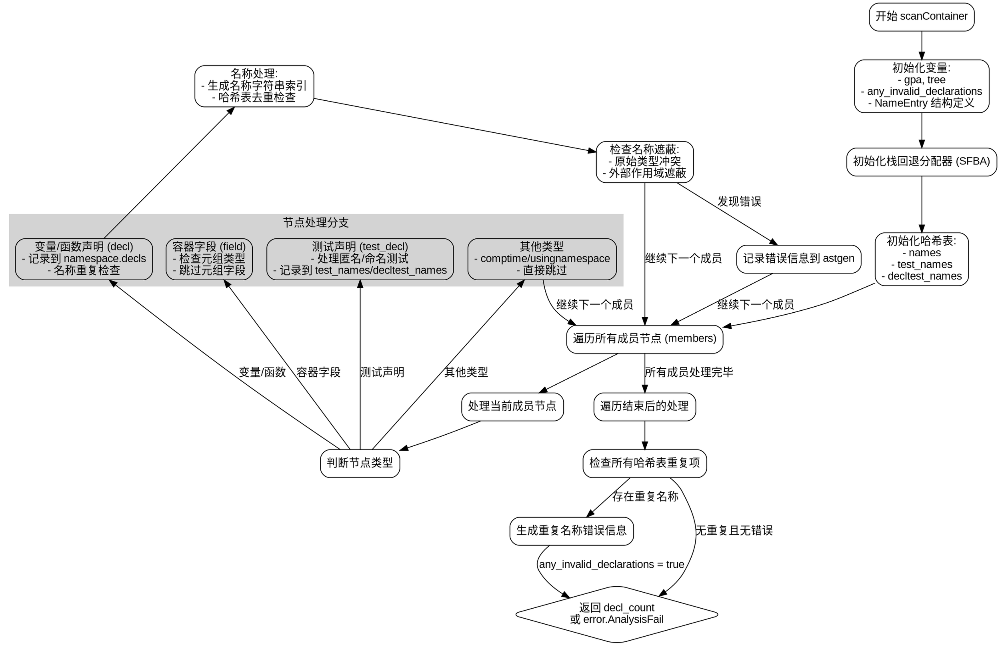

嗯，我需要为这个Zig函数`scanContainer`画一个流程图。首先，我得理解这个函数是做什么的。看起来它是用来扫描容器（比如结构体、联合体、枚举等）的成员，检查是否有重复的名称或其他错误。

函数开始于`scanContainer`，参数包括astgen、namespace、members和container_kind。然后声明了一些变量，比如gpa、tree、any_invalid_declarations等。接下来定义了一个内部结构体`NameEntry`，用于处理同名声明的情况。

然后看到使用了栈回退分配器（sfba）来管理内存，避免频繁使用全局分配器。接下来初始化了三个哈希表：names、test_names、decltest_names，用来存储不同种类的名称条目。

遍历每个成员节点（members循环），根据节点类型判断是声明（decl）还是字段（field），并处理不同的情况。比如对于测试声明（test_decl），需要处理名称重复的问题，并记录到对应的哈希表中。

在处理每个成员时，会检查名称是否与原始类型名称冲突，或者是否遮蔽了外部作用域的变量。如果有错误，会记录错误信息并设置标志位。

遍历完所有成员后，检查是否有重复的名称。如果有，生成错误信息，并记录到astgen中。最后根据是否存在错误返回结果。

现在要画流程图，我需要按照函数的执行流程分步骤：

1. 函数入口，初始化变量和分配器。
2. 遍历每个成员节点，处理不同的节点类型：
   - 容器字段（field）
   - 变量或函数声明（decl）
   - 测试声明（test_decl）
3. 对每个名称进行重复检查，记录到对应的哈希表中。
4. 检查名称是否遮蔽外部作用域或与原始类型冲突。
5. 遍历结束后，处理所有发现的重复名称，生成错误信息。
6. 根据是否有错误返回结果。

需要注意条件分支，比如是否有重复名称、是否存在无效声明等。每个判断点都要在流程图中体现出来。

可能的结构：

开始 -> 初始化变量和哈希表 -> 遍历成员节点 -> 处理不同类型的节点 -> 检查名称重复和错误 -> 收集错误信息 -> 结束并返回结果。

在处理每个成员节点时，会有多个分支，比如是decl、field还是test_decl，每个分支处理方式不同。特别是test_decl需要单独处理名称存储。

最后处理哈希表中的重复项，生成对应的错误信息，并汇总错误状态。

需要确保所有可能的路径都被覆盖，比如是否有重复名称、是否出现无效声明，是否触发错误返回等。
================================================
