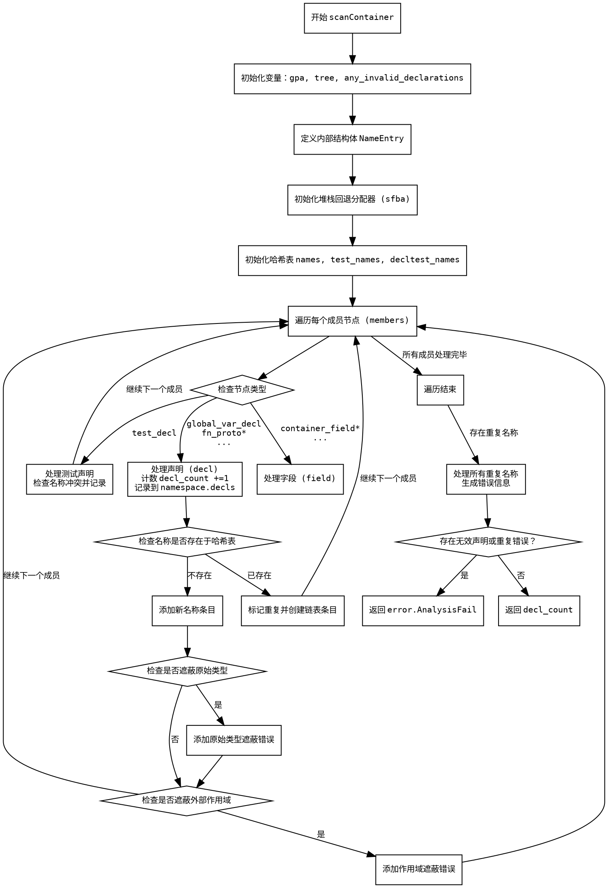

好的，我现在需要帮用户用Graphviz画出一个Zig函数的流程图。这个函数是scanContainer，看起来是处理容器成员，检查重复声明和无效声明的。首先，我需要理解这个函数的结构和逻辑流程，然后转化为流程图。

首先，函数开始于scanContainer的定义，接受astgen、namespace、members和container_kind参数，返回u32或错误。接下来，函数初始化一些变量，比如gpa、tree、any_invalid_declarations。然后定义了一个内部结构体NameEntry，用于处理同名声明的情况。

接下来，使用堆栈回退分配器（sfba）来管理names、test_names、decltest_names这三个哈希表。这些表用于跟踪不同作用域下的名称，避免重复。之后，函数遍历members中的每个成员节点，根据节点类型分类处理。

在循环内部，根据不同的节点标签（如container_field、global_var_decl、test_decl等），确定成员的类型（decl或field），并处理名称。对于测试声明和普通声明，分别处理名称冲突，记录重复情况。

处理每个成员时，如果是声明（decl），会将其添加到namespace的decls中。然后检查名称是否已经存在，如果存在则形成链表记录重复，并标记any_duplicates为true。如果是字段（field），则仅检查重复，不进行其他处理。

之后，对于decl类型，检查名称是否与原始类型（primitive）冲突，或者是否遮蔽了外部作用域的变量，添加相应的错误信息。

遍历完所有成员后，如果有重复的名称，则生成错误信息，包括所有重复的位置，并标记any_invalid_declarations为true。最后，如果有任何无效声明或重复错误，返回错误AnalysisFail，否则返回decl_count。

现在需要将这个过程转化为流程图。流程图的步骤大致如下：

1. 函数开始。
2. 初始化变量和数据结构。
3. 遍历每个成员节点。
4. 对每个节点进行分类处理（decl、field、test等）。
5. 检查名称冲突，记录错误。
6. 遍历结束后处理重复名称，生成错误信息。
7. 根据错误情况返回结果。

需要注意条件分支，比如是否有重复、是否有无效声明等。可能的分支点包括：成员类型判断、名称是否已存在、是否为原始类型名称、是否遮蔽外部变量等。

在绘制流程图时，使用菱形表示条件判断，矩形表示处理步骤，箭头连接各步骤。需要处理循环遍历members，以及可能的错误处理路径。

最后，确保所有可能的路径都被覆盖，包括正常返回decl_count和错误返回。
================================================
