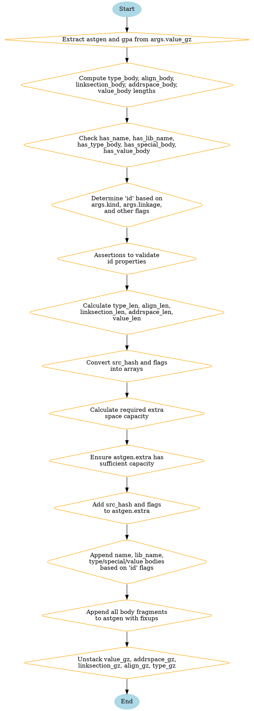

嗯，我需要为这个Zig函数`setDeclaration`画一个流程图。首先，我得理解这个函数的结构和逻辑流程。函数接受一个`decl_inst`和一些参数，然后处理这些参数，生成一些中间表示（可能是ZIR，Zig Intermediate Representation）。

首先，函数开始处定义了一些局部变量，比如从参数中提取`astgen`和`gpa`。接着，它计算了各个`gz`（可能是GenZir结构体）的指令片段的长度，比如`type_body`、`align_body`等。然后检查是否有名称、库名、类型体、特殊体（align、linksection、addrspace）以及值体。

接下来，根据不同的`args.kind`和条件，确定`id`的类型，这里有很多条件分支，比如`.const`、`.var`，以及不同的链接方式（normal、extern、export）。这一步需要仔细跟踪每个条件分支，确定对应的`id`值。

然后是一系列的断言，确保生成的`id`符合预期，比如类型体的存在与否、特殊体的存在等。这些断言是流程中的重要检查点。

之后，计算各个body的长度，将`src_hash`和`flags`转换为数组，并计算需要多少额外的空间来存储这些信息。然后确保`astgen.extra`有足够的容量，并将数据添加到其中，包括`src_hash`和`flags`。

接下来，根据`id`的特性，向`extra`中添加名称、库名、类型体长度、特殊体长度和值体长度。然后使用`appendBodyWithFixups`将各个body的内容添加到`astgen`中。

最后，函数调用`unstack`方法依次解除各个`gz`的堆栈结构，这可能是在管理生成ZIR时的作用域或堆栈状态。

画流程图的时候，需要把这些步骤按顺序排列，分支处理条件判断，尤其是`id`的确定部分有很多条件分支，可能需要用判断框来表示不同的路径。然后处理各个body的添加和最后的清理步骤。

需要注意的是，流程图的结构要清晰，每个步骤用适当的图形表示，比如开始/结束用椭圆，处理步骤用矩形，判断用菱形，箭头表示流程方向。要确保所有的条件分支都被正确表示，并且流程的顺序正确。
================================================
