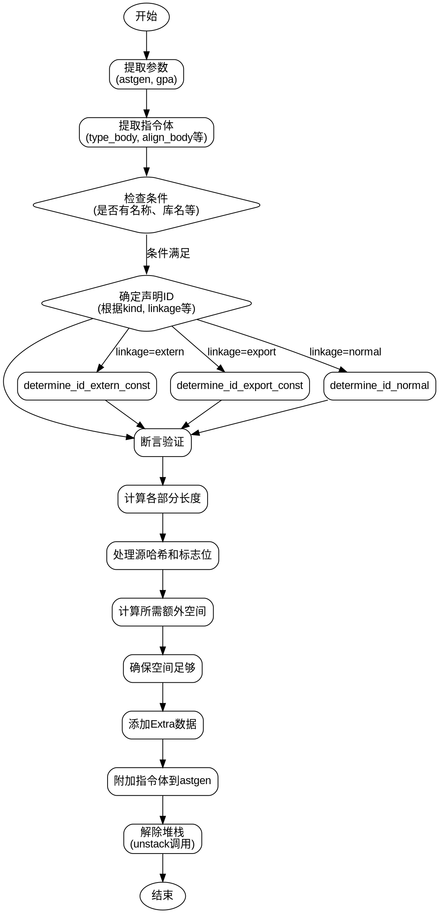

好的，我需要为给定的Zig函数`setDeclaration`绘制流程图。首先，我需要理解这个函数的结构和逻辑流程。

函数`setDeclaration`接收一个声明实例`decl_inst`和一个包含多个参数的结构体`args`。主要任务是根据不同的条件设置声明的各种属性，并将这些信息添加到AST生成器（astgen）的extra数组中。

首先，我会逐步分析函数的执行步骤：

1. **初始化与参数提取**：从`args`中获取`astgen`和`gpa`（通用分配器）。然后，从不同的`GenZir`结构体中提取各个部分的指令体（type_body, align_body等）。

2. **条件判断**：检查是否有名称、库名、类型体、特殊体（align, linksection, addrspace）以及值体。

3. **确定声明ID**：根据`args.kind`、`args.linkage`、`args.is_pub`等参数，通过多个switch语句确定`id`的值。这一步逻辑较为复杂，涉及到多个嵌套的条件判断。

4. **断言验证**：确保生成的`id`与参数的一致性，例如是否有类型体、特殊体等是否符合预期。

5. **计算各部分的长度**：使用`astgen.countBodyLenAfterFixups`计算各个指令体的长度。

6. **处理源哈希和标志位**：将`src_hash`和`flags`转换为数组，准备添加到extra中。

7. **确定需要的额外空间**：根据`id`的不同属性，计算需要预留的额外空间大小。

8. **确保足够的空间**：使用`astgen.extra.ensureUnusedCapacity`确保有足够的空间存放数据。

9. **构建并添加Extra数据**：将`src_hash`和`flags`的数据存入`astgen.extra`，并根据`id`的属性依次添加名称、库名、类型体长度、特殊体长度等。

10. **附加指令体**：将各个指令体（type_body, align_body等）附加到`astgen`中，并进行修复。

11. **解除堆栈**：依次调用`unstack`方法，解除各个`GenZir`结构体的堆栈状态。

接下来，我需要将这些步骤转化为流程图。流程图通常包括开始、结束、处理步骤、条件判断等节点，并用箭头表示流程方向。

需要注意的几个关键点：

- **条件分支**：在确定`id`时，有多个switch和条件判断，需要正确表示这些分支。
- **循环结构**：虽然函数中没有显式循环，但某些步骤可能需要处理多个数据（如附加多个指令体）。
- **并行处理**：某些步骤可以并行处理，但通常流程图是线性的，需按顺序排列。

可能的节点划分：

1. 开始
2. 提取参数和初始化
3. 提取各指令体
4. 条件判断（是否有名称、库名等）
5. 确定声明ID（多个switch分支）
6. 断言验证
7. 计算各部分长度
8. 处理源哈希和标志位
9. 计算所需额外空间
10. 确保空间足够
11. 添加Extra数据
12. 附加各指令体
13. 解除堆栈
14. 结束

在绘制时，需将条件判断（如switch语句）用菱形节点表示，处理步骤用矩形节点，箭头表示流程方向。对于复杂的条件分支，可能需要多个菱形节点或子流程图。

例如，确定`id`的部分涉及多个嵌套的switch和条件，可能需要分解为多个步骤，每个条件对应一个分支。这可能会导致流程图较为复杂，但需要保持清晰。

最后，确保所有步骤都被正确连接，特别是错误处理部分（虽然函数中使用的是`try`，但可能隐含错误路径，但根据代码，错误可能通过返回错误码处理，流程图中是否需要体现取决于详细程度）。

总结，流程图应覆盖从函数入口到出口的所有主要步骤，包括条件分支和数据处理，确保逻辑清晰，便于理解。
================================================
