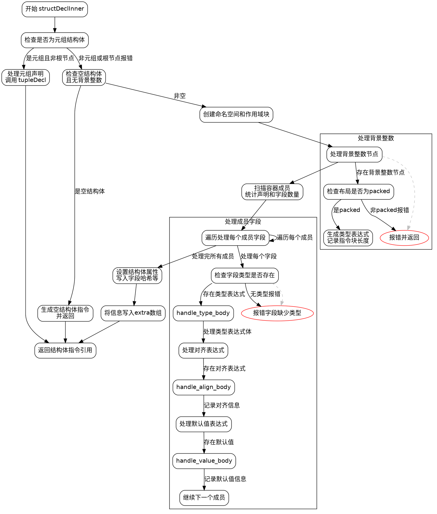

嗯，我需要为这个Zig函数structDeclInner画一个流程图。首先，我得先理解这个函数的结构和逻辑流程。函数的主要任务是处理结构体的声明，包括元组类型的检查、生成结构体的ZIR指令、处理成员字段、处理声明、处理对齐和默认值等等。

首先，函数开始于structDeclInner，参数包括GenZir指针、作用域、节点、容器声明、布局和背景整数节点。函数返回一个ZIR指令的引用或者错误。

接下来，函数检查是否是元组结构体。遍历所有成员节点，寻找是否有元组类型的字段。如果找到，并且当前节点是根节点，则报错；否则调用tupleDecl处理。

然后，函数处理空结构体的情况。如果没有成员且没有背景整数类型，生成一个空的结构体指令，设置相关属性，返回指令引用。

之后，创建一个命名空间和作用域块，用于处理结构体的成员和声明。这里可能涉及到作用域的管理和资源的释放，比如defer语句。

接着处理背景整数类型。如果存在背景整数节点，检查布局是否为packed，然后生成对应的类型表达式，处理指令块，记录背景整数体的长度。

然后扫描容器内的成员，统计声明和字段的数量。使用WipMembers来管理成员信息，包括字段名、类型、对齐、初始化值等。

接下来处理每个成员字段。遍历所有成员节点，处理每个字段的类型、对齐、默认值等信息。检查是否为comptime字段，处理类型表达式，对齐表达式和默认值表达式。同时更新结构体的属性，如是否有comptime字段、是否有默认初始化等。

在处理每个字段时，会生成对应的ZIR指令块，并将这些块的信息保存到scratch缓冲区中。同时，使用哈希来记录字段的信息，确保结构体的唯一性。

最后，设置结构体的各种属性，包括字段数量、声明数量、是否有背景整数等，并将所有生成的信息写入到astgen的extra数组中，完成结构体的构建。

现在需要将这些步骤转化为流程图。流程图应该包括主要的分支和循环，比如处理元组检查、空结构体处理、背景整数处理、成员遍历处理等。每个关键步骤需要作为流程图的一个节点，条件判断作为分支节点，循环处理成员作为循环结构。

可能的分支点包括：

1. 是否是元组结构体？如果是，处理元组；否则继续。
2. 是否有成员或背景整数？如果没有，生成空结构体。
3. 处理背景整数节点是否存在，及其合法性。
4. 遍历每个成员节点，处理每个字段的类型、对齐、初始化值，并更新结构体属性。

循环部分是对每个成员节点的处理，包括字段类型、对齐、默认值的处理，以及相关指令块的生成。

需要将这些步骤用流程图符号表示，如开始/结束节点、处理步骤、条件判断、循环等。确保逻辑流程清晰，各步骤之间的转换正确。

可能还需要注意错误处理，比如在遇到无效情况时返回错误，但流程图中可能简化错误处理为终止节点。

总之，流程图的大致结构如下：

开始 -> 检查元组结构体 -> 是？处理元组并返回 -> 否？
检查空结构体 -> 是？生成空结构体指令并返回 -> 否？
创建命名空间和作用域块
处理背景整数节点
遍历所有成员节点，处理每个字段
生成结构体属性，写入extra数组
结束

在每个步骤中，需要细化具体的处理流程，如处理背景整数时检查布局是否为packed，处理字段时的各种条件判断等。

最终，用Graphviz的DOT语言将这些步骤和分支绘制出来。
================================================
