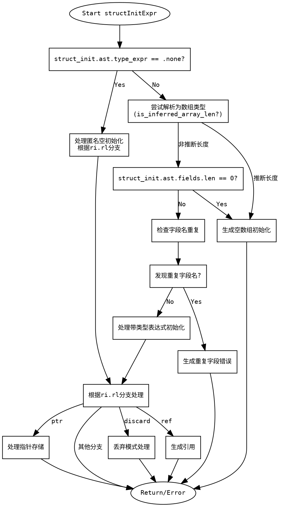

好的，我现在需要为提供的Zig函数`structInitExpr`绘制一个流程图。首先，我需要仔细理解这个函数的逻辑结构，这样才能准确地将代码流程转化为图形化的表示。

首先，我会通读整个函数，了解各个分支和逻辑流程。函数的主要任务是处理结构体的初始化表达式，根据不同的情况生成相应的ZIR指令。函数内部有多个条件分支，处理不同类型的初始化情况，例如匿名结构体初始化、带类型表达式的初始化、重复字段名的检查等。

接下来，我需要识别函数的主要分支点。例如：

1. 检查`struct_init.ast.type_expr`是否为none，如果是且没有字段，处理不同的ResultInfo情况。
2. 处理数组类型的初始化，特别是推断数组长度的情况。
3. 检查字段名是否有重复，如果有则生成错误。
4. 根据`ri.rl`的不同（如none、discard、ref等），调用不同的子函数或处理逻辑。

然后，我需要将这些分支用流程图的形式表示出来。流程图的开始是函数入口，接着按照代码的顺序依次处理各个条件分支。每个条件判断（如if、switch）对应一个菱形判断框，不同的分支走向不同的处理步骤，最后结束于返回语句或错误处理。

需要注意的是，代码中有多个嵌套的条件和循环结构，例如处理重复字段名时使用了循环遍历所有字段。这时候需要简化表示，避免流程图过于复杂。例如，可以用一个判断框表示“是否有重复字段名”，如果有则生成错误，否则继续执行。

另外，代码中的一些辅助函数调用（如`typeExpr`、`structInitExprTyped`等）可以表示为流程图的处理步骤，而不需要展开其内部逻辑，以保持流程图的清晰。

最后，需要确保流程图的正确性，即每个分支的走向与代码逻辑一致，没有遗漏重要的处理步骤。同时，使用合适的图形符号，如矩形框表示处理步骤，菱形框表示判断，箭头表示流程走向，圆形表示开始和结束点。

总结步骤：

1. 确定函数的主要逻辑分支。
2. 将每个分支转化为流程图中的判断和处理步骤。
3. 简化复杂结构，如循环处理重复字段名，合并为单一判断。
4. 使用正确的图形符号，确保流程图易于理解。
5. 验证流程图的准确性，确保与代码逻辑一致。
================================================
