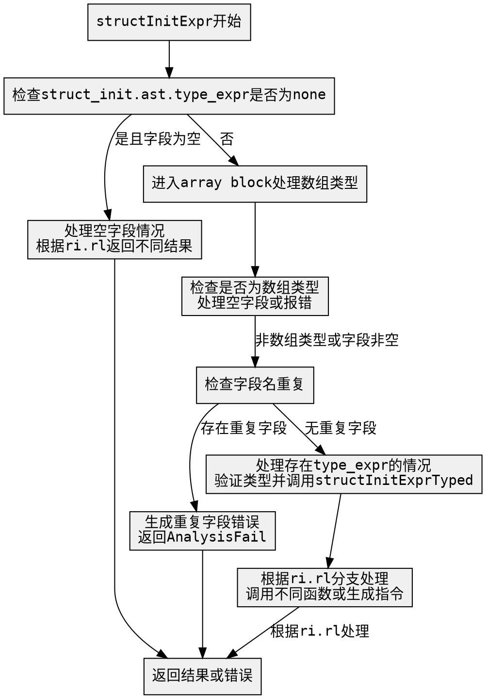

嗯，我现在需要为这个Zig函数`structInitExpr`画一个流程图。首先，我需要理解这个函数的结构和逻辑流程。让我先通读代码，看看各个部分是怎么连接的。

函数开头处理了结构体初始化表达式，首先检查`struct_init.ast.type_expr`是否为none。如果是，并且没有字段，就根据不同的结果位置（ri.rl）返回不同的指令。比如如果是discard，就返回void_value，如果是ref_coerced_ty，就调用addUnNode生成struct_init_empty_ref_result等等。

接下来有一个array的block，处理数组类型的结构体初始化。这里涉及到数组类型的解析，检查是否是推断数组长度，处理sentinel等。如果字段不为空，会报错，提示不能用结构体语法初始化数组。

然后有一个大括号内的代码块，处理重复的字段名。这里使用了一个栈回退分配器，创建了一个哈希表来检查是否有重复的字段名。如果有重复，会生成错误信息并返回AnalysisFail错误。

之后，如果存在type_expr，则处理类型化的初始化，调用structInitExprTyped函数，并根据ri.rl的不同情况处理返回结果。最后，根据ri.rl的不同情况（none、discard、ref等）调用不同的处理函数，比如structInitExprAnon或者处理指针等情况。

现在，我需要将这些逻辑步骤转化为流程图。首先，流程图的开始是函数入口，然后根据不同的条件分支展开。比如，首先检查struct_init.ast.type_expr是否为none，如果是并且没有字段，进入第一个分支；否则进入array block处理数组类型。之后检查是否有重复字段名，如果有则报错。接着处理type_expr存在的情况，最后根据ri.rl的不同情况进行不同的处理。

需要注意的是各个条件判断的分支，比如struct_init.ast.type_expr是否为none，struct_init.ast.fields.len是否为0，是否进入array block，是否有重复字段名，以及ri.rl的不同情况。每个条件判断都会导向不同的处理路径。

在画流程图时，需要用菱形表示判断条件，矩形表示处理步骤，箭头表示流程方向。还需要注意错误处理的情况，比如返回AnalysisFail或者生成错误信息。

可能的遗漏点：处理array block中的各种情况，比如is_inferred_array_len的判断，sentinel的存在与否，以及struct_init.ast.fields.len是否为0的情况。此外，处理重复字段名的部分需要遍历所有字段，收集重复项，并生成错误。

最后，根据不同的ri.rl情况，比如ref、ty、ptr等，调用不同的函数或生成不同的指令。比如在ri.rl为ref时调用structInitExprTyped并传入true，其他情况可能传入false等。

总结流程图的步骤：

1. 检查struct_init.ast.type_expr是否为none且fields为空。
   - 如果是，根据ri.rl返回不同结果。
   - 否则进入array block处理数组类型。

2. 在array block中：
   - 检查是否为数组类型，处理空字段情况。
   - 如果有字段则报错。

3. 检查字段名是否重复：
   - 遍历所有字段，收集重复的字段名。
   - 如果有重复，生成错误信息并返回错误。

4. 处理type_expr存在的情况：
   - 获取类型表达式，验证结构体初始化类型。
   - 根据ri.rl调用structInitExprTyped或其他函数。

5. 根据ri.rl的不同情况处理结果：
   - 处理none、discard、ref、ptr等情况，调用对应的函数或生成指令。

在绘制过程中，需要将这些步骤用图形表示，并正确连接各个分支，确保所有可能的路径都被覆盖，特别是错误处理的分支。
================================================
