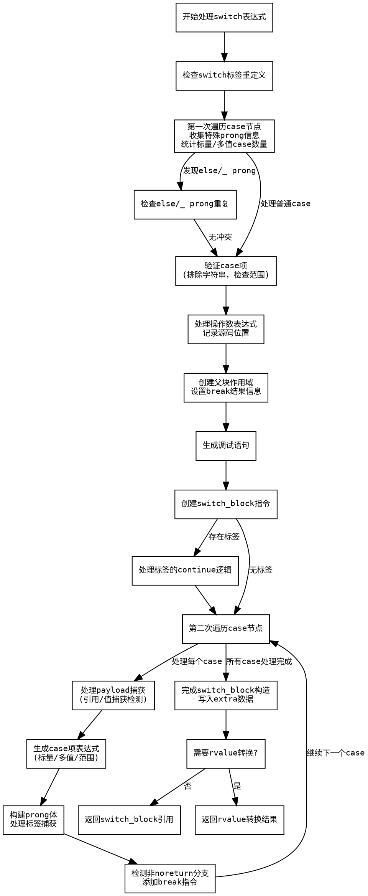

好的，我现在需要为给定的Zig函数`switchExpr`绘制一个流程图。首先，我需要理解这个函数的结构和逻辑流程。

首先，我会通读代码，了解函数的主要步骤。函数`switchExpr`处理Zig中的switch表达式生成ZIR指令。它似乎分为几个部分：处理标签、收集case信息、生成操作数、处理各种case类型（标量、多值、内联等），最后构建switch块指令。

接下来，我需要将代码分解成关键步骤，这可能包括：
1. 初始化变量和检查标签重定义。
2. 第一次遍历case节点，收集信息如特殊prong（else或_）、case类型等。
3. 处理操作数表达式。
4. 创建块作用域和switch块指令。
5. 第二次遍历case节点，生成每个case的item和body表达式，处理捕获和标签。
6. 处理标签的使用情况，生成最终的ZIR指令，并处理结果值。

然后，我需要将这些步骤转化为流程图中的节点。注意条件判断，例如是否存在特殊prong、case类型是标量还是多值、是否有标签捕获等，这些都会影响流程的分支。

需要注意的是，函数中有两次循环遍历case_nodes，第一次收集信息，第二次生成代码。每次循环中的条件判断需要正确表示。

另外，错误处理部分（如多个else prong的情况）也需要作为判断分支体现在流程图中。

在绘制流程图时，应使用矩形框表示处理步骤，菱形框表示条件判断，箭头表示流程方向。确保每个判断分支（如“是否有特殊prong？”）都有明确的yes/no路径。

最后，确保流程图的连贯性，从函数入口开始，到最终的返回结果结束，涵盖所有主要步骤和可能的分支路径。
================================================
