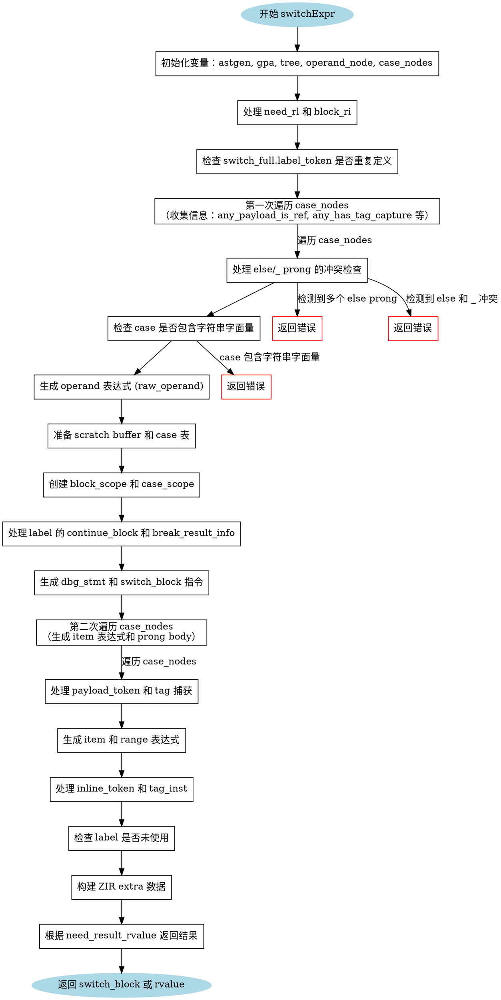

嗯，我现在需要画这个函数的流程图。这个函数是处理Zig中的switch表达式的AST生成的。首先，我得理解这个函数的结构和逻辑流程。

首先，函数名是switchExpr，参数包括parent_gz、scope、ri、node和switch_full。函数返回InnerError!Zir.Inst.Ref。看起来是生成ZIR指令的。

函数一开始声明了一些变量，比如astgen、gpa、tree、operand_node和case_nodes。然后处理了need_rl和block_ri。这里有个条件判断是否需要result_rvalue，这可能涉及到结果指针的处理。

接下来检查是否有label_token，如果有的话检查是否重复定义。然后进入第一个循环遍历case_nodes，收集信息，比如是否有payload是引用，是否有tag捕获，是否有非内联捕获，统计各种case的数量，检查else或_ prong是否重复出现，处理错误情况。

然后处理operand，生成raw_operand。如果有标签，可能需要操作数类型作为结果类型。接着处理scratch buffer，为case表分配空间。创建block_scope和case_scope，处理调试信息，生成switch_block指令。

之后再次遍历case_nodes，处理每个case的payload，包括捕获变量、处理inline情况、生成item和range表达式。这里可能会有多case和标量case的区别，处理每个case的body，生成相应的ZIR指令，并处理调试变量。

处理完所有case后，如果有标签但未使用，会添加错误信息。然后将switch_block添加到父指令中。接着构建ZIR的extra数据，包括操作数、位域信息、case表内容等。最后根据需要返回rvalue或switch_block的引用。

要画流程图的话，得拆解各个步骤，分块处理。大致步骤可能是：

1. 初始化变量，处理result info。
2. 检查label是否有重复。
3. 第一次遍历case，收集信息并检查错误。
4. 生成operand表达式。
5. 处理scratch buffer，准备case表。
6. 创建block和case作用域。
7. 第二次遍历case，生成每个case的item和body。
8. 处理标签未使用的情况。
9. 构建ZIR指令的extra数据。
10. 返回结果。

每个主要步骤下可能有子步骤，比如在第一次遍历case时处理else和_的情况，检查错误。第二次遍历生成每个case的具体内容，包括payload、inline处理等。

可能需要注意条件分支，比如是否有label，是否有特殊prong（else或_），是否有tag捕获等。每个分支会影响流程图的结构。

可能会用到的图形符号：开始和结束的椭圆，处理步骤用矩形，判断用菱形，循环用矩形加循环标记，子流程用矩形内嵌。

可能需要分块绘制，比如：

- 函数入口
- 初始化变量
- 检查label
- 第一次循环处理case，收集信息
- 生成operand
- 准备case表
- 创建作用域
- 第二次循环处理每个case的body
- 处理标签未使用
- 构建ZIR数据
- 返回结果

每个循环内部会有判断，例如是否有payload、是否是else或_ prong、是否是inline等。需要将这些判断点画出来，并根据条件分支出不同的处理流程。

在绘制时需要注意循环结构，特别是两次遍历case_nodes的情况。第一次遍历是收集信息，第二次是生成代码。每个case的处理可能涉及多个步骤，如处理payload、生成item表达式、处理range、生成body等。

可能还需要处理错误情况，比如多个else prong时会返回错误。这些错误处理应该在流程图中有所体现，作为条件判断的分支。

总之，流程图需要涵盖函数的主要逻辑步骤，包括两次case遍历、作用域的创建、ZIR指令的生成、错误检查和处理，以及最终结果的返回。需要将每个主要步骤和判断点清晰地表示出来。
================================================
