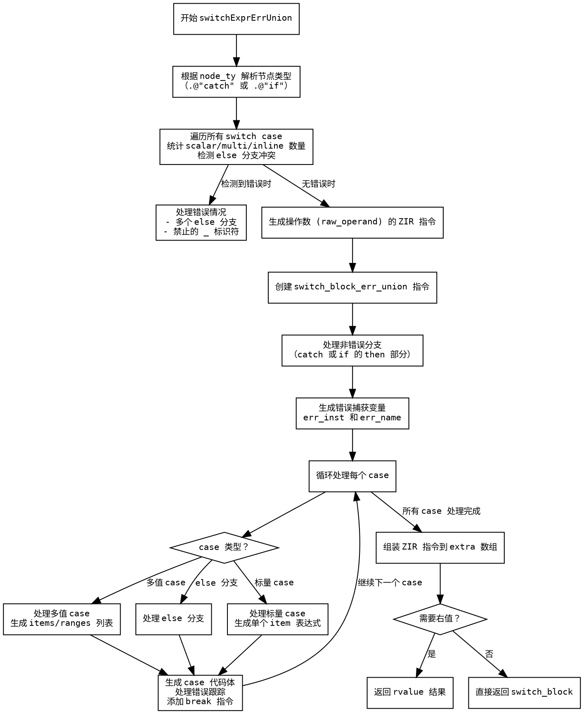

嗯，我需要帮用户画一个函数的流程图，这个函数是用Zig写的，看起来挺复杂的。首先，我得理解这个函数的结构和逻辑流程。函数名是switchExprErrUnion，可能处理switch表达式相关的错误联合类型。

先大致看一下函数的结构。函数参数有parent_gz、scope、ri、catch_or_if_node和node_ty。函数内部有很多条件判断和循环，处理不同类型的节点，比如catch和if的情况。里面有很多变量声明和AST（抽象语法树）节点的处理，比如获取操作数节点、处理switch的各个case等。

接下来，我需要理清函数的主要步骤。函数开始处根据node_ty处理不同的节点类型，可能是处理catch或if表达式中的错误联合。然后处理switch的各个case，包括else分支、标量case、多值case等。接着生成操作数的ZIR指令，处理payload，创建块作用域，生成switch_block指令，处理错误捕获，最后处理各个case的表达式，并将结果添加到父块中。

流程图应该从函数入口开始，按顺序展示各个主要步骤，包括条件分支和循环。比如，根据node_ty分为catch或if的处理分支，处理switch的case，遍历case节点，生成操作数，处理错误捕获，生成各个case的代码块，最后处理结果。

需要注意函数中有多个条件判断，比如根据node_ty的不同处理方式，是否有else分支，case的类型（标量或多值），是否有错误捕获等。这些条件分支在流程图中需要用菱形判断框表示。

可能还需要处理错误情况，比如多个else分支时的报错，或者使用_作为prong的情况，这些错误处理也应该在流程图中体现。

然后，函数中涉及到的作用域管理，比如block_scope、case_scope、sub_scope等，可能需要用不同的流程块来表示作用域的变化。

最后，生成ZIR指令的部分，如emitDbgStmtForceCurrentIndex、addBreakWithSrcNode等，可能在流程图中简化为生成指令的步骤，而不需要详细展开具体指令内容。

总结下来，流程图的大致步骤可能是：
1. 函数入口，根据node_ty处理不同的节点类型。
2. 解析switch节点，获取操作数节点和错误payload。
3. 检查是否需要结果右值（need_rl）并设置block_ri。
4. 遍历所有case节点，统计不同类型的case数量，处理else分支和错误情况。
5. 生成操作数的ZIR指令。
6. 创建块作用域和switch_block指令。
7. 处理非错误分支（比如catch或if的then部分）。
8. 处理错误捕获，生成错误变量。
9. 遍历每个case，生成对应的item表达式和case代码块。
10. 处理多值case和标量case的不同逻辑。
11. 将生成的指令添加到父块中。
12. 最后根据是否需要右值返回结果。

在绘制时，需要将这些步骤转化为流程图节点，并用箭头连接，条件判断用菱形框，处理错误的分支可能需要单独的路径。注意循环结构，比如遍历case节点的循环，需要用循环结构表示。

可能遇到的难点是处理多个嵌套的条件和循环，以及确保各个作用域和指令生成的正确顺序。需要仔细检查函数中的控制流，确保流程图准确反映代码的逻辑。
================================================
