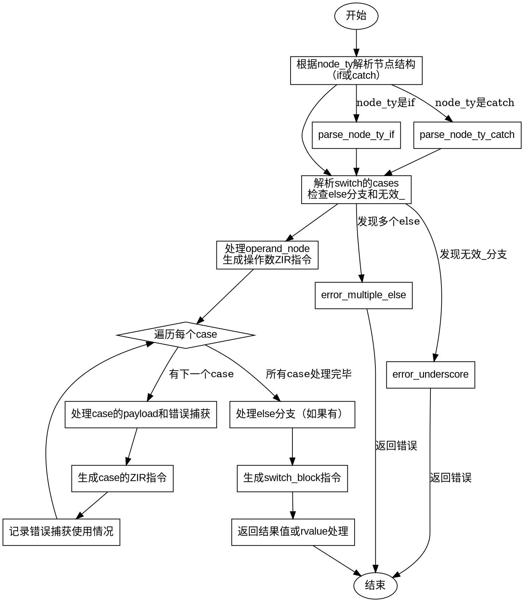

嗯，我现在需要为这个Zig函数`switchExprErrUnion`画一个流程图。首先，我需要理解这个函数的功能和结构。看起来这个函数处理的是类似switch表达式，但针对错误联合类型，可能用于生成抽象语法树（AST）或者中间表示（ZIR）。

首先，我会通读代码，看看函数的大致流程。函数接收一些参数，包括父生成器`parent_gz`、作用域`scope`、结果信息`ri`、节点索引`catch_or_if_node`和节点类型`node_ty`。返回类型是`InnerError!Zir.Inst.Ref`，说明可能会返回错误或者ZIR指令的引用。

函数开始部分处理不同的`node_ty`，可能是`catch`或`if`。根据类型不同，获取不同的节点数据，比如`if_full`。然后处理switch的各个case，包括错误检查，比如是否有多个else分支，是否有无效的`_`分支等。

接下来，处理操作数节点（operand_node），生成对应的ZIR指令。之后，处理每个case的内容，包括错误捕获和生成对应的代码块。这里涉及到很多作用域的管理，比如`block_scope`和`case_scope`，以及错误跟踪的处理。

在生成每个case的代码时，函数会处理不同的情况，比如是否是多case、是否有inline标记等。最后，将生成的各个部分整合到`switch_block`中，并处理结果值的返回。

现在，我需要将这些步骤转化为流程图。流程图通常包括开始、结束、判断、处理步骤等。关键点在于理清函数的分支结构，比如根据`node_ty`的不同处理，循环处理每个case，错误检查的分支等。

可能的步骤：
1. 开始函数。
2. 根据`node_ty`处理不同的节点结构（if或catch）。
3. 解析switch的各个case，进行错误检查（如多个else，无效_等）。
4. 处理操作数节点，生成操作数的ZIR指令。
5. 进入主处理循环，遍历每个case：
   a. 处理case的payload和错误捕获。
   b. 生成case的ZIR指令。
   c. 处理case的结果，并添加到switch_block。
6. 处理错误捕获的使用情况。
7. 生成最终的switch_block指令。
8. 根据需要返回结果值。

需要注意的条件分支：
- `node_ty`是`catch`还是`if`。
- case是否是else分支。
- 是否有多个else分支。
- case是否是多case或单case。
- 是否需要错误跟踪（do_err_trace）。
- 是否需要结果值的rvalue处理。

在画图时，使用不同的形状表示开始/结束（椭圆）、处理步骤（矩形）、判断（菱形）、循环（箭头形成环）。可能需要将大的循环部分展开，或者用子流程表示。

可能的挑战是处理复杂的条件分支和循环结构，尤其是在处理每个case时的不同情况。需要确保每个分支都被正确表示，并且流程图的连贯性。

总结，流程图的结构大致如下：
- 开始
- 初始化并根据node_ty分支
- 解析switch节点，错误检查
- 处理操作数
- 循环处理每个case
   - 处理case的payload
   - 生成case的代码
   - 错误捕获处理
- 处理else分支（如果有）
- 生成最终的switch_block
- 返回结果
================================================

该流程图展示了以下关键步骤：

1. **初始分支**：根据`node_ty`类型（`if`或`catch`）解析不同的AST结构
2. **错误检查**：在解析cases时验证分支合法性（如重复else、非法`_`）
3. **操作数处理**：生成被switch操作的错误联合值的ZIR指令
4. **循环处理cases**：
   - 为每个case生成payload捕获逻辑
   - 生成case体代码并跟踪错误捕获使用
5. **最终整合**：
   - 处理else分支（如果有）
   - 生成最终的`switch_block_err_union`指令
   - 根据结果位置需求决定返回方式

菱形节点表示条件分支，矩形为处理步骤，箭头方向表示执行流程。红色虚线路径表示可能的错误提前返回情况。