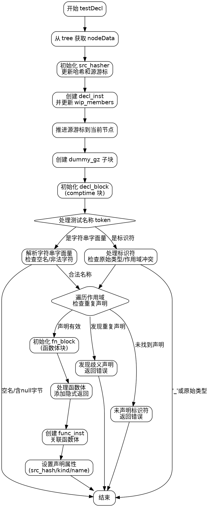

嗯，用户让我用Graphviz来画这个Zig函数testDecl的流程图。首先，我需要先理解这个函数的结构和逻辑。看起来这是一个处理AST生成的函数，特别是处理测试声明的部分。

首先，函数开始的时候，有一些参数的声明，比如astgen、gz、scope、wip_members、node。然后，从树中获取节点数据，处理源哈希，创建声明指令，更新成员列表，推进源游标到当前节点。接下来，创建了两个GenZir的块，dummy_gz和decl_block，还有fn_block。处理测试名称的token，检查是否为字符串字面量或标识符，并进行各种错误检查，比如空名、重复声明、原始类型测试等。之后设置函数块的相关参数，处理函数体，添加隐式返回，最后构建函数实例，设置声明属性。

接下来，我需要把这些步骤分解成流程图中的各个节点。可能需要注意条件分支，比如在处理test_name_token时的不同情况，还有错误处理的部分。同时，循环结构比如while循环遍历scope的情况也需要表示出来。此外，函数中有多个块的创建和解除（defer），这些块的开始和结束需要正确连接。

可能遇到的挑战是如何将复杂的逻辑结构简化为清晰的流程图步骤，尤其是嵌套的条件和循环。需要确保每个判断点都有对应的分支，并且各个块的开始和结束正确连接。另外，处理错误返回的路径也需要在流程图中体现出来，可能用不同的箭头或颜色表示错误路径。

现在，我需要将这些步骤转化为Graphviz的节点和边。每个主要操作或条件判断作为一个节点，使用菱形表示判断，矩形表示操作。例如，处理test_name_token是否为字符串或标识符，然后对应的处理流程。同时，处理循环遍历scope的部分可能需要一个循环结构的表示。

最后，确保流程图的逻辑正确，覆盖函数的所有主要路径，包括错误处理和正常流程。可能需要多次检查代码，确认每个步骤的顺序和关系，避免遗漏重要的分支或步骤。
================================================
