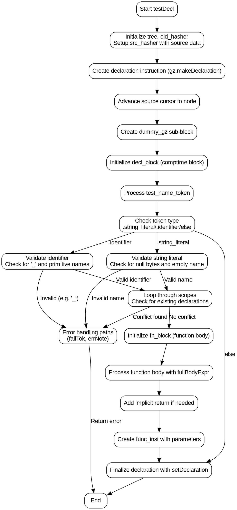

好的，我需要为提供的Zig函数testDecl绘制一个流程图。首先，我需要理解这个函数的结构和逻辑流程。函数testDecl似乎负责处理测试声明的生成，涉及到AST（抽象语法树）和ZIR（Zig Intermediate Representation）的生成。

首先，我会通读代码，识别主要的步骤和条件分支。例如，函数开始初始化一些变量，处理测试名称的解析，检查标识符的有效性，生成函数块，处理返回值等。关键点包括处理字符串字面量和标识符作为测试名称的不同情况，错误处理，以及生成函数体和隐式返回。

接下来，我需要确定各个步骤之间的顺序和条件转移。例如，当处理test_name_token时，根据不同的token类型（如.string_literal或.identifier）会有不同的处理逻辑。这里会有条件分支，需要体现在流程图中。

然后，注意循环和递归结构。例如，在处理作用域时有一个while循环，遍历不同的作用域类型（如.local_val、.local_ptr、.namespace等），查找声明并检查冲突。这需要表示为循环结构。

此外，错误处理部分，如返回错误信息的情况，也需要在流程图中标注出来。例如，当检测到空测试名或非法标识符时，函数会通过astgen.failTok返回错误。

在生成函数体和ZIR指令时，会有子块的创建和管理，如dummy_gz和decl_block的创建与解除堆栈（unstack）。这些块的嵌套关系也需要在流程图中体现。

最后，确保流程图的开始和结束点正确，包括函数的入口、各个处理步骤，以及最终的返回或错误出口。

总结一下，绘制流程图的步骤包括：

1. 确定函数入口。
2. 初始化和变量设置。
3. 处理测试名称的不同情况（字符串字面量、标识符等）。
4. 作用域遍历和冲突检查。
5. 错误处理路径。
6. 函数块和ZIR指令的生成。
7. 隐式返回和块解除。
8. 最终设置声明并结束。

需要注意条件分支、循环结构以及错误处理路径的正确表示。使用Graphviz的节点和箭头来连接各个步骤，确保逻辑清晰，结构合理。
================================================
