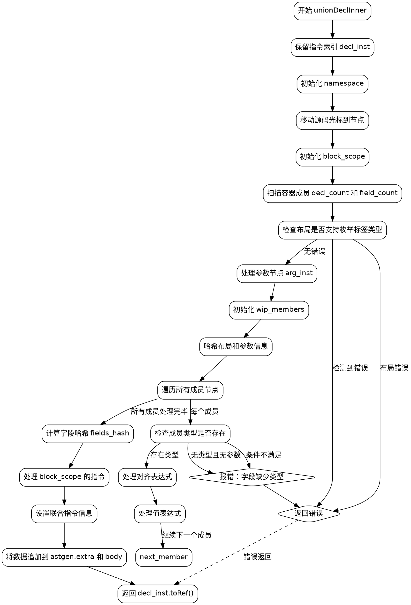

好的，我需要为给定的Zig函数`unionDeclInner`绘制一个流程图。首先，我要理解这个函数的结构和主要步骤。

函数开始于`fn unionDeclInner`，接受多个参数，包括生成ZIR的指针、作用域、AST节点等。主要任务是处理联合类型的声明，生成相应的ZIR指令。

首先，函数保留一个指令索引`decl_inst`，然后初始化命名空间和作用域块。接着，处理联合的成员，扫描容器中的声明和字段。这里可能会有错误检查，比如布局不支持枚举标签类型的情况。

接下来，处理参数节点和自动枚举标签，初始化WipMembers来管理成员信息。遍历所有成员节点，处理每个字段的类型、对齐和值，同时进行各种错误检查，如缺少类型或标记值等。

在处理完所有成员后，计算字段的哈希，处理作用域块中的指令，设置联合的ZIR指令，并将相关信息写入astgen的extra和body中。最后返回生成的指令引用。

流程图需要涵盖这些主要步骤，包括错误处理、循环遍历成员、条件判断（如布局检查、参数存在性等）、以及数据结构的初始化和清理（如namespace、block_scope、wip_members的defer操作）。

需要注意函数的控制流，比如defer语句确保资源释放，循环处理每个成员，条件分支处理不同的错误情况，以及最后的指令设置和数据追加。

现在，将这些步骤转化为Graphviz的节点和边，确保每个主要操作和条件分支都有对应的节点，并用箭头连接表示流程走向。同时，标注关键操作和错误处理路径。
================================================
