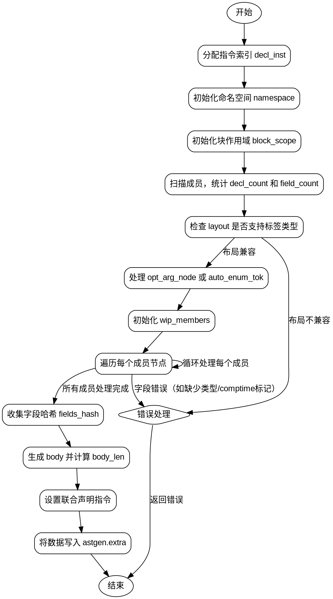

嗯，我需要为这个Zig函数`unionDeclInner`画一个流程图。首先，我得理解这个函数的结构和逻辑。函数看起来是处理联合类型的声明，生成相应的ZIR指令。让我先通读一遍代码，看看主要的步骤和条件分支。

函数开始于声明一些变量，比如`decl_inst`，然后初始化`namespace`和`block_scope`。接着处理成员节点，扫描容器中的声明和字段。然后检查布局和参数节点的兼容性。处理每个成员的字段，包括类型、对齐、值等。之后处理字段的哈希，生成最终的指令，并将结果写入astgen的额外数据中。

主要的步骤可能有：
1. 准备指令索引和命名空间。
2. 初始化作用域和块。
3. 扫描成员，统计声明和字段数量。
4. 检查布局是否支持标签类型。
5. 处理参数节点和自动枚举标签。
6. 遍历每个成员，处理字段信息。
7. 收集字段哈希。
8. 生成并设置联合声明的ZIR指令。
9. 将数据写入astgen的extra部分。

需要注意条件分支，比如检查`layout`是否为auto，是否有`auto_enum_tok`或`opt_arg_node`，处理成员时的各种错误情况，如缺少类型、comptime标记等。

流程图应该包括开始和结束节点，每个主要步骤作为处理节点，条件判断作为菱形分支，错误处理作为单独的分支。可能还需要循环结构来处理每个成员节点。

需要确认每个步骤之间的顺序，是否有循环或递归的部分。例如，遍历`members`数组，处理每个成员节点，这里应该是一个循环结构。

同时，错误处理的部分可能有多个返回点，比如`astgen.failNode`或`astgen.failTok`，这些应该在流程图中表示出来。

现在，我需要将这些步骤和条件用Graphviz的dot语言表示出来，形成流程图。需要注意节点的连接和条件判断的分支方向。
================================================
