好的，我需要为提供的Zig函数`varDecl`绘制一个流程图。首先，我需要理解这个函数的结构和逻辑流程。

首先，函数`varDecl`处理变量声明，包括`const`和`var`两种情况。函数开始于`emitDbgNode`，然后进行一系列检查和处理。

1. **初始步骤**：
   - 调用`emitDbgNode`生成调试信息。
   - 获取`astgen`和`tree`。
   - 提取变量名`ident_name_raw`，检查是否为`_`，若是则报错。
   - 检测局部变量阴影（shadowing），如果存在则报错。
   - 检查是否有初始化节点`init_node`，若无则报错。

2. **处理地址空间和段（section）**：
   - 如果存在`addrspace_node`或`section_node`，报错，因为局部变量不支持这些属性。

3. **处理对齐（align）**：
   - 如果有`align_node`，生成对应的ZIR指令，否则为`.none`。

4. **根据`mut_token`类型（const或var）分支处理**：
   - **对于`const`**：
     - 检查是否有冗余的`comptime`关键字。
     - 根据是否需要结果位置（result location）决定是否分配内存。
     - 处理初始化表达式，生成对应的ZIR指令。
     - 创建子作用域`Scope.LocalVal`或`Scope.LocalPtr`。
   - **对于`var`**：
     - 检查是否有冗余的`comptime`关键字。
     - 分配内存（根据是否指定类型和对齐）。
     - 处理初始化表达式。
     - 解析推断的分配（resolve inferred alloc）。
     - 创建子作用域`Scope.LocalPtr`。

需要注意的条件分支，比如`align_inst`是否为`.none`，是否指定了类型节点，以及是否需要推断类型等。此外，错误处理和调试信息的添加也是流程中的关键步骤。

在绘制流程图时，需要将主要步骤作为节点，条件判断作为分支，处理不同情况的分支路径。确保逻辑流程清晰，特别是`const`和`var`的不同处理路径，以及各种错误检查的位置。
================================================

```dot
digraph flowchart {
    node [shape=rectangle, style="rounded", fontname="Courier"];
    edge [fontname="Courier"];

    start [label="开始varDecl函数"];
    emit_dbg [label="调用emitDbgNode生成调试信息"];
    get_astgen_tree [label="获取astgen和tree"];
    check_underscore [label="检查变量名是否为'_'"];
    error_underscore [label="报错：'_'需要@\"_\"语法", shape=box, color=red];
    detect_shadow [label="检测局部变量阴影"];
    check_init_node [label="检查是否有初始化节点"];
    error_no_init [label="报错：变量必须初始化", shape=box, color=red];
    check_addrspace [label="检查addrspace_node是否存在"];
    error_addrspace [label="报错：不能设置局部变量的地址空间", shape=box, color=red];
    check_section [label="检查section_node是否存在"];
    error_section [label="报错：不能设置局部变量的段", shape=box, color=red];
    handle_align [label="处理对齐align_node"];
    switch_mut_token [label="根据mut_token类型分支", shape=diamond];
    handle_const [label="处理const声明"];
    handle_var [label="处理var声明"];
    return_scope [label="返回子作用域"];

    start -> emit_dbg;
    emit_dbg -> get_astgen_tree;
    get_astgen_tree -> check_underscore;

    check_underscore -> error_underscore [label="是"];
    check_underscore -> detect_shadow [label="否"];
    error_underscore -> detect_shadow [style=invis];

    detect_shadow -> check_init_node;
    check_init_node -> error_no_init [label="无初始化"];
    check_init_node -> check_addrspace [label="有初始化"];
    error_no_init -> check_addrspace [style=invis];

    check_addrspace -> error_addrspace [label="存在"];
    check_addrspace -> check_section [label="不存在"];
    error_addrspace -> check_section [style=invis];

    check_section -> error_section [label="存在"];
    check_section -> handle_align [label="不存在"];
    error_section -> handle_align [style=invis];

    handle_align -> switch_mut_token;

    switch_mut_token -> handle_const [label="keyword_const"];
    switch_mut_token -> handle_var [label="keyword_var"];

    subgraph cluster_const {
        label="处理const分支";
        style=dashed;
        const_check_comptime [label="检查comptime_token是否冗余"];
        const_force_comptime [label="标记强制comptime"];
        const_check_align [label="检查align_inst是否为.none"];
        const_handle_init [label="处理初始化表达式"];
        const_add_validate [label="添加validate_const指令"];
        const_add_dbg_val [label="添加dbg_var_val调试"];
        const_create_scope_val [label="创建LocalVal子作用域"];
        const_handle_ptr [label="处理指针分配"];
        const_resolve_inferred [label="解析推断指针"];
        const_add_dbg_ptr [label="添加dbg_var_ptr调试"];
        const_create_scope_ptr [label="创建LocalPtr子作用域"];

        handle_const -> const_check_comptime;
        const_check_comptime -> const_force_comptime;
        const_force_comptime -> const_check_align;
        const_check_align -> const_handle_init [label="条件满足"];
        const_handle_init -> const_add_validate;
        const_add_validate -> const_add_dbg_val;
        const_add_dbg_val -> const_create_scope_val -> return_scope;

        const_check_align -> const_handle_ptr [label="条件不满足"];
        const_handle_ptr -> const_resolve_inferred;
        const_resolve_inferred -> const_add_dbg_ptr;
        const_add_dbg_ptr -> const_create_scope_ptr -> return_scope;
    }

    subgraph cluster_var {
        label="处理var分支";
        style=dashed;
        var_check_comptime [label="检查comptime_token冗余"];
        var_handle_alloc [label="处理内存分配"];
        var_handle_init [label="处理初始化表达式"];
        var_resolve_inferred [label="解析推断指针"];
        var_add_dbg_ptr [label="添加dbg_var_ptr调试"];
        var_create_scope_ptr [label="创建LocalPtr子作用域"];

        handle_var -> var_check_comptime;
        var_check_comptime -> var_handle_alloc;
        var_handle_alloc -> var_handle_init;
        var_handle_init -> var_resolve_inferred;
        var_resolve_inferred -> var_add_dbg_ptr;
        var_add_dbg_ptr -> var_create_scope_ptr -> return_scope;
    }

    return_scope [shape=ellipse];
}
```
