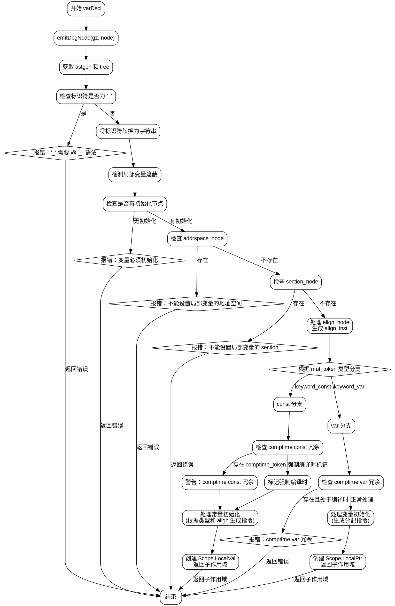

好的，我需要为这个Zig函数`varDecl`绘制流程图。首先，我需要理解这个函数的结构和逻辑流程。

首先，函数开始于`try emitDbgNode(gz, node);`，这是生成调试信息的步骤。然后获取`astgen`和`tree`，处理变量名，检查是否使用了`_`作为标识符，如果是则报错。

接下来，调用`astgen.detectLocalShadowing`来检测局部变量的遮蔽问题。然后检查是否有初始化表达式，如果没有则报错。

之后，处理`addrspace_node`和`section_node`，如果存在则报错。然后处理`align_node`，生成对应的指令。

根据`var_decl.ast.mut_token`的类型（`const`或`var`），分两个主要分支处理：

1. **`const`分支**：
   - 检查是否有冗余的`comptime`关键字。
   - 根据是否存在类型节点，处理初始化表达式的结果位置（rvalue或lvalue）。
   - 生成对应的ZIR指令，处理可能的错误跟踪。
   - 创建子作用域并返回。

2. **`var`分支**：
   - 检查是否有冗余的`comptime`关键字。
   - 处理类型节点，生成分配指令。
   - 处理初始化表达式，处理可能的推断类型。
   - 创建子作用域并返回。

在流程中，需要注意条件判断，比如`align_inst`是否为`.none`，是否存在类型节点，以及是否处于编译时上下文等。每个分支可能还有子分支，比如处理`const`时的不同结果位置，以及处理`var`时的不同类型分配。

需要将这些步骤转化为流程图中的节点和判断框，确保逻辑顺序正确，分支清晰。同时，错误处理和提前返回的情况也需要在流程图中体现，比如在检查到错误时直接返回错误节点。
================================================
