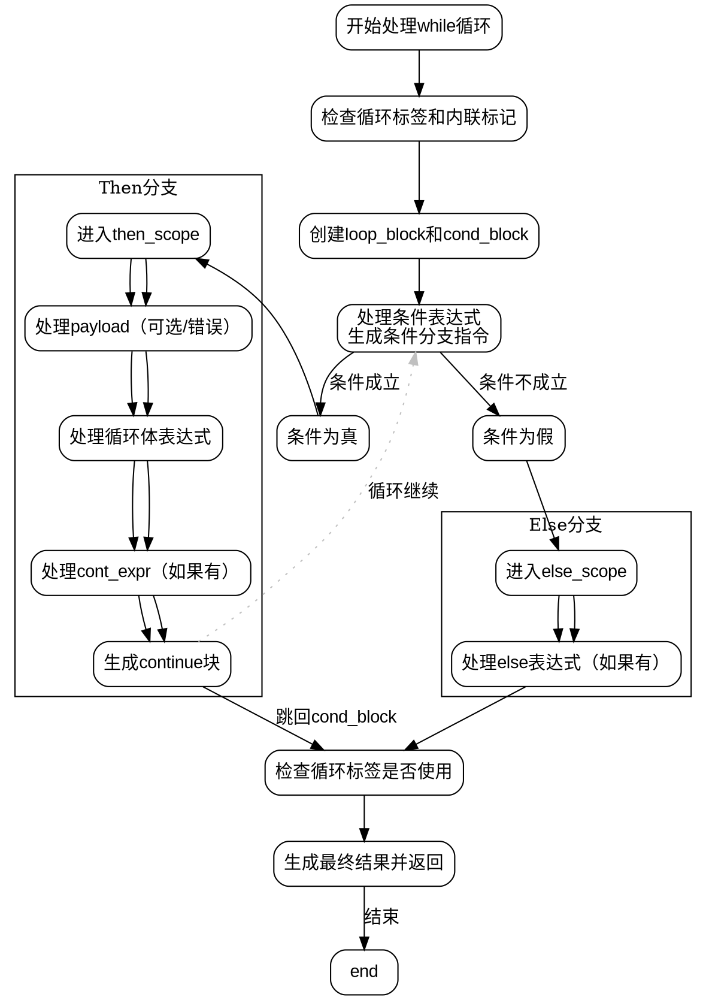

好的，我现在需要为给定的Zig函数`whileExpr`绘制一个流程图。首先，我需要仔细理解这个函数的结构和逻辑。这个函数处理while表达式的生成ZIR（Zig Intermediate Representation）的过程。看起来它处理了很多不同的情况，比如带有标签的循环、内联循环、错误处理、可选类型等。

首先，我应该梳理函数的主要步骤。函数开始处理条件表达式，然后创建循环块（loop_block）和条件块（cond_block）。接着处理循环体（then部分）和else部分。然后处理continue和break的逻辑，以及可能的错误处理分支。

接下来，我需要确定各个代码块之间的流程关系。例如，循环块的开始，条件判断的分支（条件为真进入then部分，否则进入else部分）。在then部分中，可能会处理payload，生成continue块，然后处理循环体中的表达式。而else部分则处理错误或循环结束的情况。

同时，需要注意一些特殊情况，比如是否需要结果值（need_result_rvalue），是否有内联标记（inline_token），是否有错误处理（error_token），以及循环标签的处理等。这些都会影响流程图的分支和节点。

我可能会遗漏一些细节，比如`emitDbgNode`和`addDbgVar`这样的调试信息生成步骤，是否需要在流程图中体现？可能不需要，因为流程图主要关注控制流而不是调试信息。另外，像作用域（scope）的创建和解除（unstack）可能也需要在流程图中表示出来，比如子作用域的创建。

在处理条件分支时，函数使用`condbr_tag`（可能是条件分支指令），根据条件结果跳转到不同的块。然后，then_scope和else_scope分别处理不同的分支路径。循环体的处理涉及到continue块和break块，这些块如何连接到循环的继续或退出也需要明确。

另外，循环结束后的结果处理部分，是否需要将结果返回，或者是否需要生成rvalue，这也会影响流程图的结束部分。

现在，我需要将这些步骤转化为图形化的节点和箭头。可能的节点包括：

1. 开始处理while循环。
2. 检查是否有标签，处理内联标记。
3. 创建loop_block和cond_block。
4. 处理条件表达式，生成条件分支。
5. 条件为真时进入then_scope：
   a. 处理payload（如果有）。
   b. 处理循环体表达式。
   c. 生成continue块。
   d. 处理cont_expr（如果有）。
6. 条件为假时进入else_scope：
   a. 处理else表达式（如果有）。
   b. 否则生成默认结果。
7. 处理循环标签是否被使用。
8. 生成最终结果并返回。

需要注意循环结构，loop_block可能会跳回到cond_block以形成循环。而break和continue会影响流程的转向。

可能存在的挑战是正确表示循环的继续和退出，特别是continue块和break块的位置。同时，处理错误分支和可选类型的分支也需要正确连接到相应的处理部分。

我需要确保流程图中每个判断点都有明确的分支，比如条件判断后分为then和else路径，循环体内的处理是否结束或继续循环等。

最后，使用Graphviz的DOT语言将这些节点和连接绘制出来，确保逻辑清晰，结构正确。
================================================
