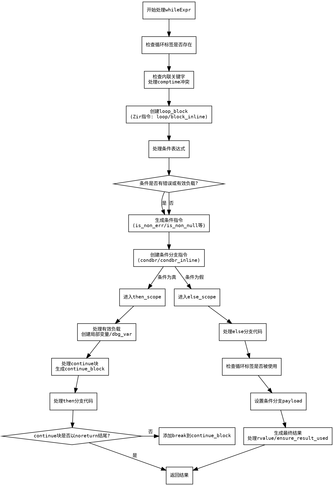

嗯，我需要为给定的Zig函数`whileExpr`绘制一个流程图。首先，我应该仔细阅读代码，理解它的结构和逻辑流程。这个函数处理while表达式，生成对应的Zir指令。看起来代码中有很多条件分支和作用域的处理，比如处理循环标签、内联、条件判断、错误处理、有效负载（payload）等。

首先，我需要确定函数的主要步骤。函数开始处理循环标签、内联关键字，然后创建循环块。接着处理条件表达式，根据是否有错误或有效负载生成不同的条件判断指令。之后处理then分支（循环体）和else分支（循环结束后的代码），包括可能的继续块（continue block）和中断块（break block）。最后设置条件分支的payload，处理结果，并返回。

接下来，我需要将这些步骤转化为流程图中的节点和判断分支。可能的节点包括：

1. 开始处理while表达式。
2. 检查循环标签和内联关键字。
3. 创建循环块（loop_block）。
4. 处理条件表达式，生成条件判断（cond）。
5. 根据条件结果，分为then分支和else分支。
6. 处理then分支中的payload和循环体。
7. 处理continue块和循环体的结束。
8. 处理else分支中的错误或结束逻辑。
9. 检查循环标签是否被使用。
10. 设置条件分支的payload并生成最终结果。

需要注意条件判断，比如是否有错误处理、有效负载是否存在，以及是否内联等。每个条件判断会产生不同的流程分支。例如，当存在错误处理时，会生成不同的条件检查指令；当有有效负载时，可能需要创建局部变量等。

在绘制流程图时，需要正确连接这些节点，并用条件判断节点（如菱形）来表示不同的路径。例如，处理条件表达式后，根据是否有错误或有效负载进入不同的处理逻辑。同时，循环体和else分支的处理也需要正确的连接，包括可能的break和continue语句。

可能还需要处理作用域的变化，比如进入then_scope、else_scope、continue_scope等子作用域，这些作用域的创建和结束应该在流程图中体现出来。例如，使用子流程框来表示这些作用域内的处理步骤。

最后，确保流程图的结束点正确，返回结果或者处理错误情况。

需要特别注意代码中的各个条件分支，如`if (while_full.error_token)`, `if (while_full.payload_token)`, 以及不同的Zir指令生成。每个条件分支都需要在流程图中有一个对应的判断节点，并分支出不同的处理路径。

此外，循环块的创建、条件分支的设置（condbr）、continue和break块的处理，都是流程中的关键步骤，需要明确在流程图中表示出来。例如，`condbr`指令会根据条件结果跳转到then分支或else分支，这两个分支的处理完成后，最终会回到循环块或者退出循环。

可能还需要处理结果值的生成，如是否需要rvalue，以及是否作为语句使用，这会影响最终的返回结果。

总结来说，流程图应该从函数入口开始，按照代码的逻辑顺序，逐步展开各个处理步骤，包括条件判断、作用域创建、指令生成、结果处理等，并用箭头连接各个步骤，正确表示程序的控制流。
================================================
