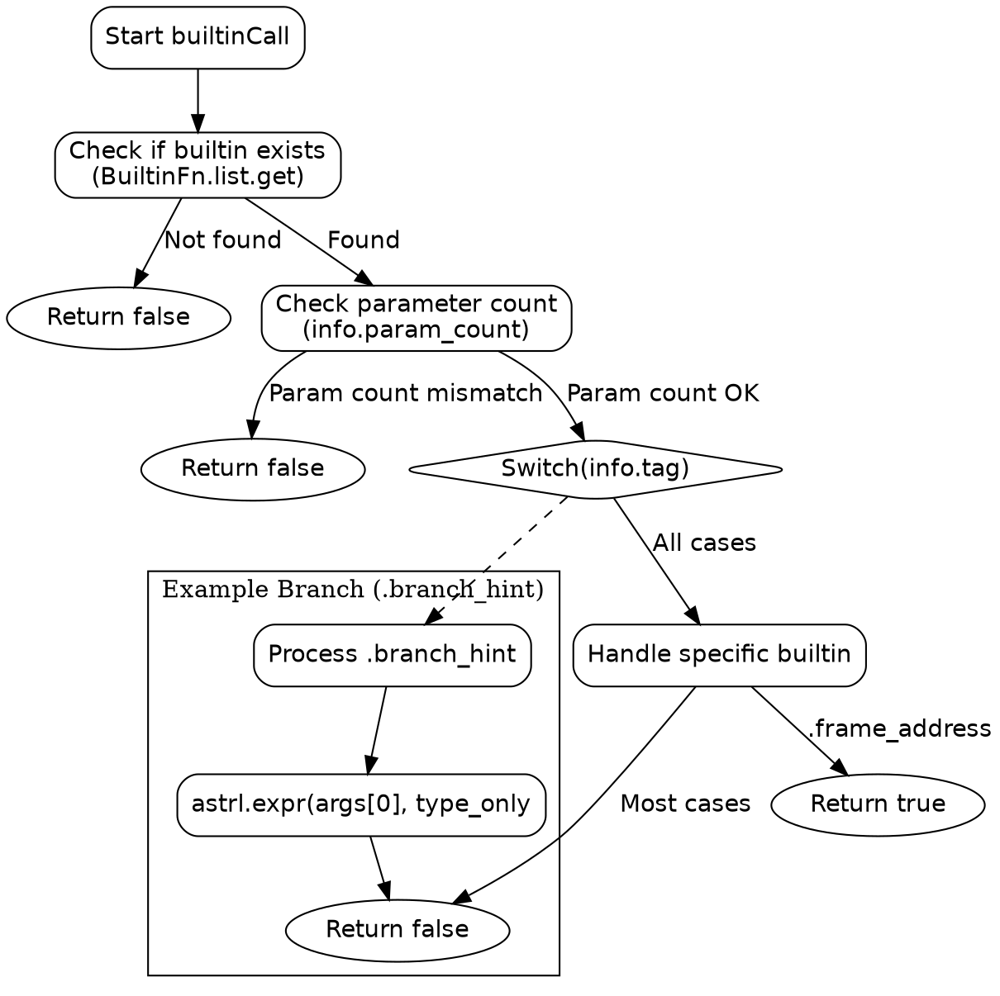

好的，我现在需要为一个用Zig编写的函数`builtinCall`生成Graphviz的流程图。首先，我需要理解这个函数的结构和逻辑，这样才能正确地绘制出流程图。

首先，我会通读整个函数代码，了解其基本结构。函数`builtinCall`接受几个参数，并返回一个`!bool`。看起来这个函数处理不同的内置函数调用，根据不同的内置函数标签（`info.tag`）执行不同的操作。函数的主要部分是一个大的switch语句，处理各种不同的标签，每个标签对应不同的参数处理和表达式求值逻辑。

接下来，我需要确定流程图的主要节点和分支。显然，最大的分支是那个庞大的switch语句，每个case对应不同的内置函数处理流程。每个case中可能会有不同的参数数量检查和调用`astrl.expr`的方式。因此，流程图需要反映这些不同的分支和处理步骤。

首先，流程图应该有一个起点，即函数入口。然后检查是否是已知的内置函数（通过`BuiltinFn.list.get`），如果不是，返回false。接着检查参数数量是否符合预期，如果不符合，同样返回false。之后进入switch语句，根据不同的标签处理不同的逻辑。每个case中可能会有不同的参数处理步骤，比如调用`astrl.expr`多次，并传递不同的`ResultInfo`参数。

需要注意的是，有些case处理完后直接返回false，而有些可能有不同的返回路径。比如，在`frame_address`的情况下返回true，而其他大部分返回false。此外，每个case中调用的`astrl.expr`的次数和参数类型（如`ResultInfo.type_only`或`ResultInfo.none`）可能不同，需要在流程图中体现这些差异。

绘制流程图时，可能需要将每个case作为一个独立的分支，描述其具体的处理步骤。由于switch的case非常多，可能需要将主要的分支归类，或者用子图来组织，以避免流程图过于庞大和复杂。例如，可以将处理单个参数的case归类在一起，处理多个参数的另作一类，以此类推。

另外，需要注意到函数一开始的几个步骤：获取内置函数名称，检查参数数量，这些都是公共步骤，应该在流程图的开始部分。然后根据不同的标签进入不同的处理流程。

可能的挑战是如何有效地组织和简化大量的case分支，使得流程图既全面又不显得杂乱。可能需要将一些相似的case合并描述，或者用注释说明某些分支的共有逻辑。

最后，生成Graphviz的DOT语言代码时，需要正确使用节点和边的标记，确保逻辑流程正确无误。每个判断节点（如switch的各个case）需要有对应的分支，处理步骤后连接到返回节点或下一个处理步骤。
================================================

这个流程图包含以下核心逻辑：

1. 入口点检查是否是已知内置函数
2. 参数数量校验
3. 主switch分支处理不同内置函数
4. 特殊返回值处理（如.frame_address返回true）
5. 示例子流程展示典型处理逻辑（虚线框表示可扩展部分）

实际完整流程图需要：
1. 为每个switch分支创建子图
2. 详细绘制每个分支的参数处理步骤
3. 用不同形状区分判断节点/执行节点/返回节点
4. 用颜色标注不同类型的ResultInfo参数（type_only/none）

由于原函数包含50+个分支，完整流程图会非常庞大。实际工程中建议：
1. 按功能分组（如数学运算/类型操作/原子操作等）
2. 使用折叠子图
3. 添加颜色编码区分处理模式
4. 使用工具自动生成（如基于AST）