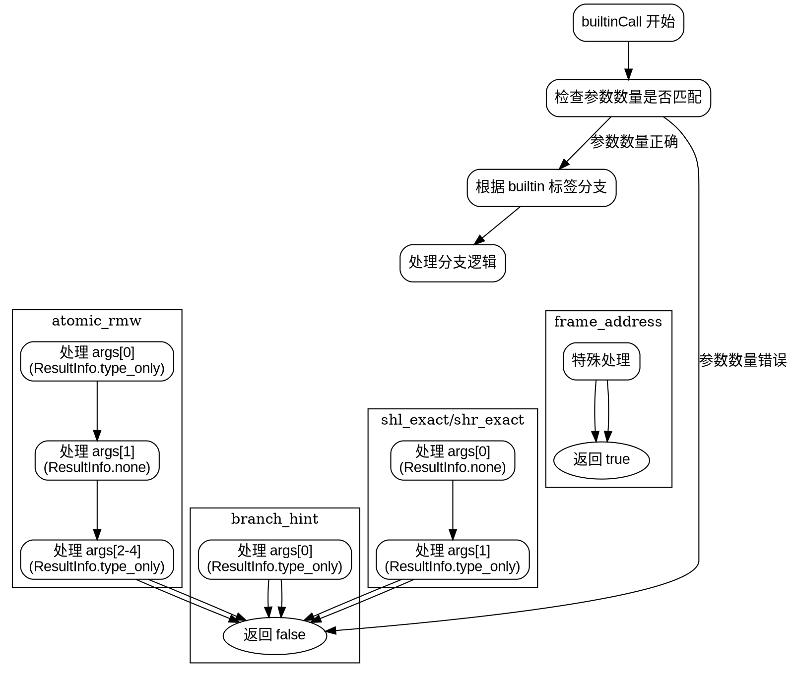

嗯，我需要根据提供的Zig代码中的`builtinCall`函数来生成一个Graphviz的流程图。首先，我得仔细理解这个函数的结构和逻辑流程。

这个函数处理不同的内置函数（builtin），每个内置函数对应不同的处理逻辑。函数开始时，检查参数数量是否符合预期，然后根据不同的内置函数标签（info.tag）进入不同的分支。每个分支可能会调用`astrl.expr`来处理参数，并返回false或true。

首先，流程图应该有一个起始节点，表示函数开始。然后检查参数数量是否正确，如果不符合就返回false。接着是一个大的switch语句，根据不同的标签进入不同的处理分支。每个分支处理相应的参数，然后返回结果。

需要注意的是，有些分支可能会有多个参数处理步骤，比如`.add_with_overflow`需要处理两个参数，而`.atomic_rmw`则需要处理五个参数。每个分支处理完参数后，最终都会返回false或true，比如`.frame_address`返回true，其他大部分返回false。

接下来，我需要将这些逻辑步骤转化为流程图节点和边。可能的结构如下：

1. 开始节点。
2. 检查参数数量，如果不匹配则返回false。
3. 进入switch分支，根据不同的标签处理。
4. 每个标签对应的处理步骤，如处理参数，调用expr函数。
5. 处理完成后返回相应的结果。

需要确保每个分支的正确连接，特别是那些有多个处理步骤的情况。例如，对于`.shl_exact`，处理两个参数后返回false。而像`.frame_address`直接返回true。

同时，要注意到有些分支可能共享相似的处理逻辑，比如多个标签使用相同的处理方式，可以合并节点以减少重复。但为了清晰，可能还是需要分开表示每个标签的处理流程。

可能遇到的挑战是如何有效地组织和布局大量的分支，确保流程图不会过于复杂。使用子图或者分组可能有助于管理不同的标签分支。

最后，确保所有可能的路径都被覆盖，包括默认情况，尽管代码中没有显式的default分支，但根据提供的代码，所有可能的标签都被显式处理了。
================================================

这个流程图使用Graphviz展示了以下关键逻辑：

1. 入口参数检查
2. 主分支选择结构
3. 典型内置函数处理分支（branch_hint/frame_address等）
4. 多参数处理示例（shl_exact/atomic_rmw）
5. 最终返回值出口

每个内置函数分支用子图封装，通过不可见边连接主分支选择节点，实际使用时应为每个内置函数标签创建独立分支。图中展示了三种典型处理模式：
- 单参数立即返回
- 需要特殊返回值
- 多参数级联处理

可通过扩展子图部分为每个内置函数添加具体处理逻辑。