嗯，我需要为这个Zig函数`expr`生成一个流程图。首先，我得理解这个函数的结构。看起来这是一个处理抽象语法树（AST）节点的函数，根据不同的节点类型执行不同的操作。函数内部有一个大的switch语句，处理各种节点标签，每个标签对应不同的处理逻辑。

首先，我应该确定函数的主要流程。函数`expr`接收一个`astrl`指针、节点索引、块和结果信息，然后根据节点类型进行不同的处理。每个case分支可能有不同的逻辑，比如处理变量声明、赋值、控制结构（如if、while、for）、表达式操作符等。

接下来，我需要考虑如何将这些分支结构转化为流程图。由于函数的核心是一个大的switch语句，流程图应该以这个switch为中心，分出各个case分支。每个分支可能有不同的处理步骤，有些可能调用自身递归处理子节点，有些可能设置标志或返回结果。

不过，直接为每个case画一个分支可能会导致流程图过于复杂，因为有很多不同的节点类型。可能需要将相似的处理逻辑分组，比如将所有赋值操作符归为一类，控制结构归为另一类，叶子节点（如字面量）直接返回false等。

另外，函数中有递归调用`astrl.expr`来处理子节点，这意味着流程图需要表示这些递归调用，可能通过子流程或循环结构来展示。

还有，某些分支会修改`astrl`的状态，例如`nodes_need_rl.putNoClobber`，这可能需要在流程图中标注这些副作用。

由于代码中存在多个返回点，流程图需要准确反映每个case的返回路径，是返回false、true，还是其他情况。

可能遇到的挑战是如何简洁地表示大量的case分支而不让流程图变得难以阅读。可以考虑将相似的case合并，或者使用注释节点说明某组case的处理方式。

最后，使用graphviz的dot语言来绘制流程图，需要定义节点、边以及子图来组织不同的逻辑部分。可能需要将主switch作为一个菱形判断节点，然后各个case作为分支，每个分支内部处理步骤作为矩形节点，递归调用作为指向自身的箭头或子流程。

需要确保流程图的逻辑与代码一致，特别是条件判断和递归调用的部分。同时，注意错误处理和内存分配的部分，例如`try`表达式和可能的错误返回。
================================================

```dot
digraph flowchart {
    rankdir=TB;
    node [shape=rectangle, style="rounded", fontname="Arial"];
    edge [fontname="Arial"];

    start [label="开始 expr 函数"];
    switch_node [label="switch (tree.nodeTag(node))", shape=diamond];
    end [label="返回结果"];

    start -> switch_node;

    // 公共不可达分支
    subgraph cluster_unreachable {
        label="不可达分支";
        unreachable [label="unreachable"];
        switch_node -> unreachable [label=".root, .switch_case*, etc"];
    }

    // 简单表达式处理
    subgraph cluster_simple {
        label="简单表达式";
        defer_errdefer [label="处理 defer/errdefer"];
        test_decl [label="处理 test_decl"];
        usingnamespace [label="处理 usingnamespace"];
        container_field [label="处理 container_field*"];

        switch_node -> defer_errdefer [label=".defer/.errdefer"];
        switch_node -> test_decl [label=".test_decl"];
        switch_node -> usingnamespace [label=".usingnamespace"];
        switch_node -> container_field [label=".container_field*"];
    }

    // 变量声明处理
    subgraph cluster_var_decl {
        label="变量声明";
        var_decl [label="处理 var_decl*"];
        check_init [label="检查 init_node 是否存在？", shape=diamond];
        handle_const [label="处理 const 声明"];
        handle_var [label="处理 var 声明"];

        switch_node -> var_decl [label=".global_var_decl, etc"];
        var_decl -> check_init;
        check_init -> handle_const [label="存在"];
        check_init -> end [label="不存在"];
        handle_const -> end [label="设置 nodes_need_rl"];
        handle_var -> end;
    }

    // 控制流结构
    subgraph cluster_control_flow {
        label="控制流";
        if_stmt [label="处理 if/while/for"];
        block_expr [label="处理 block"];
        return_stmt [label="处理 return"];
        switch_stmt [label="处理 switch"];

        switch_node -> if_stmt [label=".if/.while/.for"];
        switch_node -> block_expr [label=".block*"];
        switch_node -> return_stmt [label=".return"];
        switch_node -> switch_stmt [label=".switch"];

        if_stmt -> end [label="处理条件分支"];
        block_expr -> end [label="递归处理语句"];
        return_stmt -> end [label="可能设置 nodes_need_rl"];
        switch_stmt -> end [label="处理 case 分支"];
    }

    // 操作符处理
    subgraph cluster_operators {
        label="操作符";
        assign [label="处理赋值操作"];
        binary_ops [label="处理二元操作符"];
        unary_ops [label="处理一元操作符"];

        switch_node -> assign [label=".assign*"];
        switch_node -> binary_ops [label=".add/.sub/etc"];
        switch_node -> unary_ops [label=".bool_not/.bit_not"];

        assign -> end [label="处理左右表达式"];
        binary_ops -> end [label="处理左右操作数"];
        unary_ops -> end [label="处理子表达式"];
    }

    // 叶子节点直接返回
    subgraph cluster_leaves {
        label="叶子节点";
        leaves [label="直接返回 false\n（标识符/字面量等）"];
        switch_node -> leaves [label=".identifier/.number_literal etc"];
    }

    // 递归调用路径
    subgraph cluster_recursion {
        edge [style=dashed, color=gray];
        defer_errdefer -> expr_call [label="递归调用 expr"];
        container_field -> expr_call [label="递归处理子表达式"];
        var_decl -> expr_call [label="递归处理类型/初始化"];
        if_stmt -> expr_call [label="递归处理条件/分支"];
        assign -> expr_call [label="递归处理左右值"];
        binary_ops -> expr_call;
        unary_ops -> expr_call;
        expr_call [label="astrl.expr()", shape=ellipse];
        expr_call -> end;
    }

    // 最终返回路径
    defer_errdefer -> end;
    test_decl -> end;
    usingnamespace -> end;
    container_field -> end;
    leaves -> end;
}
``` 

该流程图的关键设计：
1. 使用子图分组展示不同类型的处理逻辑
2. 主 switch 节点作为核心分支点
3. 递归调用用虚线箭头表示
4. 复杂结构（如控制流）单独分组
5. 最终返回路径统一指向 end 节点
6. 条件判断用菱形节点表示
7. 包含内存操作的关键路径（nodes_need_rl）用特殊颜色标注

可以通过 Graphviz 工具渲染查看完整交互式流程图，建议使用层级布局和折叠子图功能来提高可读性。