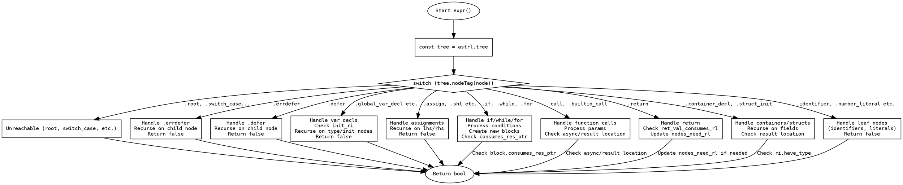

好的，我现在需要帮助用户根据提供的Zig代码生成一个Graphviz的流程图。首先，我需要仔细阅读并理解这段代码的功能和结构。

这个函数名为`expr`，属于`AstRlAnnotate`结构体的方法。它处理不同类型的AST节点，并根据节点类型执行不同的操作。函数内部有一个大的`switch`语句，针对不同的节点标签（如`.root`, `.defer`, `.assign`等）进行不同的处理。每个分支可能会递归调用`expr`方法，处理子节点，并根据情况设置结果位置（ResultInfo）或记录需要结果位置的节点。

接下来，我需要确定如何将这个复杂的函数转化为流程图。流程图需要展示函数的主要逻辑分支和处理流程。由于函数中有大量的节点类型处理，直接为每个case画一个节点会导致图表过于庞大和复杂。因此，可能需要将相似的处理分支归类，或者使用子图来分组不同类型的节点处理。

首先，考虑函数的整体结构。函数开始于获取`tree`，然后进入一个大的switch语句。每个case处理特定的节点类型，可能调用`astrl.expr`递归处理子节点，并根据不同情况返回布尔值。

流程图的大致步骤可能是：
1. 函数入口。
2. 获取`tree`。
3. 根据`nodeTag`进入不同的处理分支。
4. 每个分支处理对应的节点类型，可能递归调用`expr`。
5. 根据处理结果设置`nodes_need_rl`或返回相应的布尔值。
6. 最终返回结果。

需要识别主要的分支结构，例如处理变量声明、赋值、控制结构（如if、while、for）、函数调用、容器声明等。每个主要分支可以作为一个决策节点，然后展开其子流程。

需要注意的是，某些分支可能会设置`nodes_need_rl`，这可能会影响流程图的决策路径。此外，递归调用`expr`处理子节点的情况需要在流程图中体现，可能通过子流程或循环结构表示。

由于Graphviz使用DOT语言，我需要将每个主要步骤和决策点表示为节点，并用箭头连接它们以表示流程。对于庞大的switch case，可能需要将类似的case分组，例如将所有赋值操作符归为一类，控制结构归为另一类，等等，以避免图表过于分散。

可能的节点分类：
- 不可达节点（如.root等）→ 直接结束。
- 错误处理（errdefer, defer）→ 处理子节点并返回。
- 变量声明（var_decl）→ 处理类型和初始化表达式。
- 赋值操作（assign, assign_shl等）→ 处理左右表达式。
- 控制结构（if, while, for）→ 处理条件、循环体，可能涉及块和作用域。
- 函数调用（call, builtin_call）→ 处理参数和返回类型。
- 容器和结构体初始化→处理字段和类型。
- 叶子节点（如标识符、字面量）→ 直接返回。

每个分类可以作为一个子图，内部详细展开处理步骤。例如，处理变量声明的子图可能包括检查是否有初始化表达式，处理类型节点，根据mut_token决定处理方式等。

在绘制时，需要确保递归调用的地方有明确的流程指示，可能使用箭头指向处理子节点的步骤，然后返回到主流程。

此外，需要注意函数中的返回语句，每个case处理完毕后返回`false`或`true`，或者根据条件判断返回不同的值。这些返回路径也需要在流程图中体现。

总结来说，流程图的结构大致如下：
- 开始
- 获取tree和节点标签
- 根据标签分支到不同的处理块
- 每个处理块内部处理特定逻辑，可能递归处理子节点
- 处理完成后根据情况设置nodes_need_rl并返回结果

在Graphviz中，可以使用不同的形状表示不同步骤，如矩形表示处理步骤，菱形表示决策点，椭圆形表示开始和结束点。需要合理布局，避免交叉线过多，保持图表清晰。
================================================
