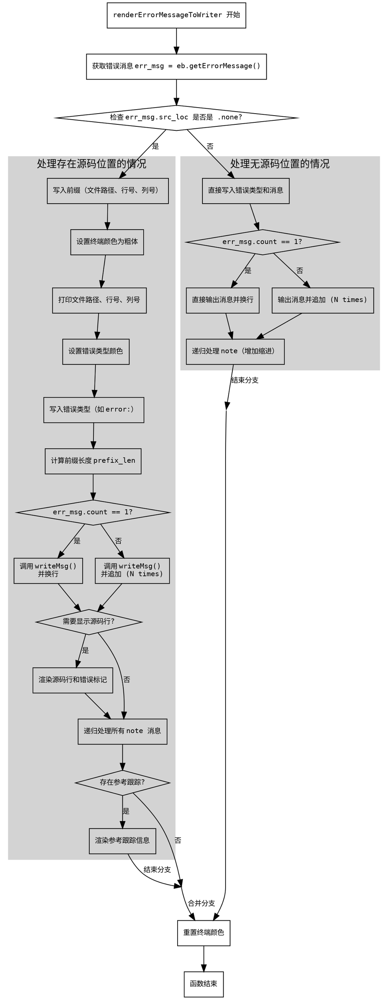

嗯，用户让我用Graphviz来画这个Zig函数的流程图。首先，我需要理解这个函数的结构。看起来这是一个渲染错误信息的函数，里面有很多条件判断和循环。比如，首先检查err_msg.src_loc是否是.none，然后根据不同的情况处理，可能有多个分支，比如处理错误消息、源文件位置、参考跟踪等等。

接下来，我需要确定函数的主要流程。函数开始时会获取错误消息，然后根据是否有源位置信息分成两个主要分支。如果有源位置，会打印详细的错误信息，包括文件路径、行号、列号，还可能显示源代码行和符号标记。此外，如果有注释或参考跟踪，还会递归调用自身来处理这些内容。

如果源位置不存在，则处理较为简单，直接输出错误类型和消息，同样处理可能的注释。

在画流程图时，每个条件判断（如if语句）都会产生分支节点，循环结构（如for循环）也需要表示出来。递归调用自身的地方可能需要用子流程或者单独的节点来表示。

需要注意的是，Graphviz使用DOT语言，所以需要正确使用节点和边的语法。可能需要将函数分解为多个步骤，每个步骤对应一个节点，条件判断作为菱形节点，不同的分支用箭头连接。同时，递归调用可能需要用单独的节点或者注释来说明。

还需要注意，用户特别指出不要使用Mermaid，所以必须确保生成的是正确的Graphviz DOT代码，而不是Mermaid语法。因此，在编写过程中要避免混淆两者之间的语法差异。

最后，检查流程图的逻辑是否正确覆盖了函数的所有分支和循环，确保没有遗漏重要的步骤，比如错误处理、颜色设置、写入输出等细节。
================================================
