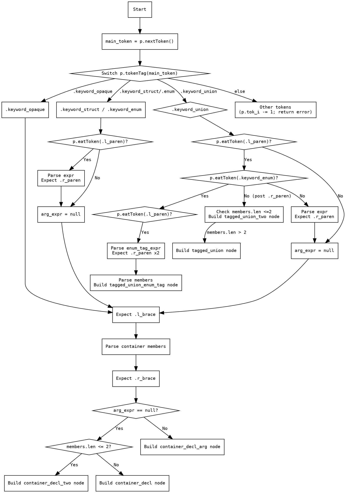

好的，我需要为给定的Zig函数`parseContainerDeclAuto`绘制一个流程图。首先，我需要仔细阅读并理解这个函数的逻辑。函数的主要任务是解析容器声明，比如结构体、枚举、联合等。函数内部有很多条件分支，根据不同的token来执行不同的解析路径。

首先，函数从`main_token = p.nextToken()`开始，获取下一个token。然后根据token的类型进入不同的分支：

1. 如果token是`.keyword_opaque`，则`arg_expr`为null。
2. 如果是`.keyword_struct`或`.keyword_enum`，检查是否有左括号，如果有则解析表达式，否则`arg_expr`为null。
3. 如果是`.keyword_union`，处理更复杂的情况：
   - 检查是否有左括号，如果有则进一步检查是否是枚举类型。
   - 如果是枚举类型，可能有嵌套的括号和表达式，并解析成员。
   - 否则，解析表达式并继续。
4. 其他情况则回退token索引并报错。

接下来，函数会处理左大括号，解析容器成员，然后处理右大括号。根据`arg_expr`是否存在以及成员的数量和是否有尾随内容，生成不同的节点类型。

现在需要将这些逻辑步骤转化为流程图。每个条件判断对应一个菱形判断框，不同的分支用箭头连接。需要注意的是，`switch`语句中的各个情况以及后续的处理步骤都需要明确表示出来。特别是联合类型的处理中有多层嵌套的条件，需要仔细分解。

可能的结构如下：

- 开始 -> 获取main_token
- 根据main_token的类型分支：
  - opaque：直接到解析成员
  - struct/enum：检查是否有左括号，解析表达式或null
  - union：更复杂的子分支
  - 其他：报错
- 解析成员后根据条件生成不同的节点

需要注意处理联合类型内部的多个条件判断，比如是否有`keyword_enum`，是否还有左括号等。每个条件判断后的处理步骤都要在流程图中体现，比如解析表达式、解析成员、生成不同节点类型等。

最后，确保所有可能的路径都被覆盖，并且箭头指向正确，避免遗漏任何分支。对于复杂的嵌套条件，可能需要使用子流程或者更详细的分解来保持流程图的清晰性。
================================================

该流程图使用Graphviz DOT语言绘制，完整呈现以下逻辑：

1. 从获取main_token开始，根据token类型进入不同分支
2. 处理struct/enum时检查括号和表达式
3. 处理union时多层嵌套条件（枚举标签、成员数量判断）
4. 公共路径：
   - 解析大括号和成员
   - 根据arg_expr和成员数量生成不同AST节点类型
5. 错误处理分支直接返回错误

复杂嵌套条件使用菱形决策节点，关键解析步骤用矩形表示，返回节点用方框标注。通过分层排列保持代码结构与流程图的可读性一致。