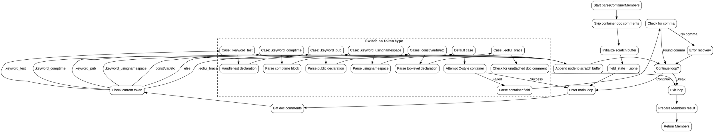

嗯，用户给了我一个用Zig编写的函数parseContainerMembers，并要求我用Graphviz画出它的流程图。首先，我需要理解这个函数的结构和逻辑流程，然后才能将其转换为流程图。

首先，我会通读代码，大致了解函数的各个部分。函数parseContainerMembers似乎是用来解析容器成员的，比如结构体或枚举的成员。它处理各种关键字和情况，比如测试声明、编译时块、公共声明、使用命名空间等。

接下来，我需要确定函数中的主要流程和控制结构。看起来函数使用了一个无限循环（while (true)），在循环内部根据不同的token标签进行处理。每个case处理不同的关键字或符号，比如.keyword_test、.keyword_comptime、.keyword_pub等等。每个case内部可能有条件判断和错误处理。

然后，我需要识别函数中的各个分支和循环结构。例如，函数开始时会跳过容器文档注释，然后进入主循环。主循环内有一个大的switch语句，根据当前token的类型进入不同的处理分支。每个分支可能会有不同的处理逻辑，比如解析字段、处理声明、处理错误等。

此外，函数中使用了defer语句来处理资源的释放，这在流程图中可能需要表示为某个步骤后的清理操作。同时，错误处理部分需要特别注意，比如catch语句和错误恢复机制。

在绘制流程图时，需要将每个主要步骤和条件判断转化为节点和判断框。例如，函数开始时会执行一些初始化操作，然后进入循环，每次循环处理一个token。每个token类型对应不同的处理逻辑，处理完成后可能会改变field_state的状态，或者向scratch缓冲区添加节点。

需要注意的是，流程图中要展示循环结构、条件分支、错误处理路径，以及函数的返回点。特别是返回部分，根据scratch中的items长度不同，返回不同的Members结构。

可能的挑战在于如何将复杂的嵌套条件和错误处理逻辑清晰地可视化。可能需要将大的switch语句分解为多个子流程，或者使用子图来组织不同的分支。同时，需要确保流程图的箭头正确反映代码的执行顺序，包括循环的继续和中断。

最后，需要将所有这些分析结果转化为Graphviz的DOT语言，定义各个节点、边的连接关系，以及条件判断的标签。确保生成的流程图既准确又易于理解。
================================================
