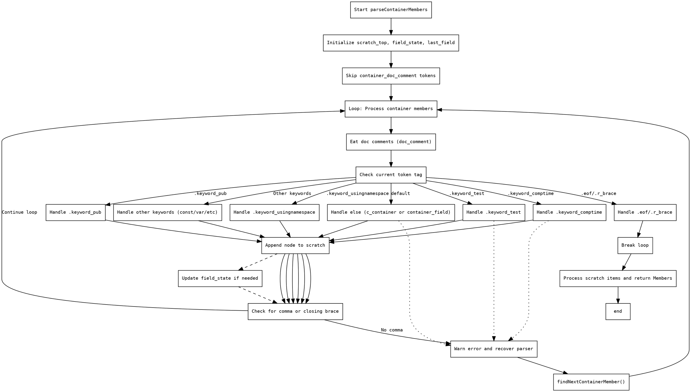

好的，我需要为提供的Zig函数`parseContainerMembers`绘制一个流程图。首先，我要理解这个函数的结构和逻辑流程。

函数开始部分初始化了一些状态变量，如`scratch_top`、`field_state`、`last_field`等。然后处理容器文档注释，进入一个循环，逐个解析容器成员。循环内部根据不同的token标签（如`.keyword_test`、`.keyword_comptime`等）处理不同的情况，比如测试声明、编译时块、公共声明、命名空间使用等。每个分支可能会修改`field_state`，并将解析的节点添加到`scratch`中。循环结束后，根据收集到的成员数量返回相应的`Members`结构。

接下来，我需要将这些逻辑步骤转化为流程图。流程图应包含开始和结束节点，初始化变量，循环结构，条件判断（如不同的token分支），错误处理，以及最终的返回部分。需要注意各个条件分支之间的关系，特别是循环内的多个`switch`和`case`情况，可能需要分解为多个判断节点。

需要注意的是，由于函数中存在多个嵌套的条件判断和循环，流程图可能会变得较为复杂。需要合理组织节点，避免交叉线过多，保持流程图的清晰。同时，要正确表示`defer`语句和错误处理路径，例如`catch`块中的处理逻辑。

另外，`field_state`的不同状态（`none`、`seen`、`end`、`err`）会影响后续处理，这些状态的变化应在流程图中体现。例如，当遇到`keyword_pub`时，如果`field_state`为`seen`，则更新为`end`，并将节点添加到`scratch`中。

最后，函数的返回部分根据`items`的长度决定返回结构体的`data`字段类型，这部分也需要在流程图中表示。

总结步骤：
1. 开始节点。
2. 初始化变量（scratch_top，field_state等）。
3. 处理容器文档注释。
4. 进入主循环，处理各个成员：
   a. 处理文档注释。
   b. 根据当前token进入不同分支（如test声明、comptime块、pub声明等）。
   c. 更新状态变量，处理错误，添加节点到scratch。
5. 循环结束条件（遇到eof或r_brace）。
6. 处理最后的items，返回Members结构。

需要确保每个条件分支正确连接，状态转移清晰，特别是循环内的多个分支和错误恢复路径。
================================================

这个流程图：
1. 使用菱形节点表示条件分支
2. 用虚线表示状态更新等次要路径
3. 用点线表示错误恢复路径
4. 保持了代码中：
   - 初始化阶段
   - 主解析循环
   - 各种token处理分支
   - 错误恢复机制（findNextContainerMember）
   - 最终结果组装
的完整逻辑流程

可以通过Graphviz工具渲染成矢量图，建议使用`dot -Tsvg`命令生成可缩放的高质量流程图。