好的，我需要为给定的Zig函数`parsePrimaryTypeExpr`绘制一个流程图。首先，我需要理解这个函数的结构和逻辑流程。

函数开始于一个`switch`语句，根据当前令牌的标签（`p.tokenTag(p.tok_i)`）进行不同的处理。每个`case`分支对应不同的令牌类型，执行相应的解析操作，并返回节点索引或错误。

首先，我需要列出所有的`case`分支，并理清每个分支的处理逻辑。例如，处理`.char_literal`时，会创建一个字符字面量节点；处理`.number_literal`时，创建数字字面量节点，依此类推。

接下来，注意到有些分支会调用其他函数，如`parseBuiltinCall()`、`parseFnProto()`等。这些调用应该在流程图中表示为子流程或步骤。同时，部分分支包含嵌套的`switch`语句，例如处理`.identifier`时，会根据下一个令牌的不同进一步分支。

对于条件判断，如`.identifier`后的`switch (p.tokenTag(p.tok_i + 1))`，需要将这些条件作为决策节点。例如，如果下一个令牌是`.colon`，则进入另一个判断；否则直接处理为标识符节点。

另外，循环结构，如处理多行字符串字面量时的`while`循环，也需要在流程图中表示。循环继续的条件是当前令牌是否为`.multiline_string_literal_line`，直到不再满足为止。

还需要注意错误处理和提前返回的情况。例如，某些分支中如果遇到不符合预期的令牌，会调用`p.fail(...)`返回错误，这些需要在流程图中体现为错误出口。

最后，将所有分支和子流程连接起来，确保逻辑的正确性和流程的完整性。可能需要使用不同的形状来表示开始、结束、处理步骤、决策节点等。

总结步骤：
1. 确定函数的入口和出口。
2. 列出所有主要的`case`分支作为决策节点。
3. 对于每个分支，详细展开其内部逻辑，包括嵌套的条件判断和循环。
4. 将函数调用（如`parseBuiltinCall()`）作为处理步骤。
5. 处理错误情况和提前返回。
6. 使用合适的图形符号（如菱形表示决策，矩形表示处理步骤，椭圆形表示开始/结束）来构建流程图。

需要确保流程图的准确性和可读性，正确反映函数的控制流。
================================================

```dot
digraph parsePrimaryTypeExpr {
    graph [fontname="Arial", rankdir=TB];
    node [fontname="Arial", shape=rectangle];
    edge [fontname="Arial"];

    start [label="开始 parsePrimaryTypeExpr", shape=ellipse];
    end [label="返回节点或错误", shape=ellipse];
    switch_token [label="switch(p.tokenTag(p.tok_i))", shape=diamond];

    start -> switch_token;

    // 基本字面量处理
    subgraph cluster_literals {
        label="字面量处理";
        char_lit [label="处理.char_literal\n创建字符字面量节点"];
        number_lit [label="处理.number_literal\n创建数字字面量节点"];
        unreachable_lit [label="处理.keyword_unreachable\n创建unreachable节点"];
        anyframe_lit [label="处理.keyword_anyframe\n创建anyframe节点"];
        string_lit [label="处理.string_literal\n创建字符串字面量节点"];
        multiline_str [label="处理.multiline_string_literal_line\n创建多行字符串节点"];
    }

    // 复合结构处理
    subgraph cluster_structures {
        label="复合结构处理";
        builtin_call [label="处理.builtin\n调用parseBuiltinCall()"];
        fn_proto [label="处理.keyword_fn\n调用parseFnProto()"];
        if_expr [label="处理.keyword_if\n调用parseIf()"];
        switch_expr [label="处理.keyword_switch\n调用expectSwitchExpr()"];
        container_decl [label="处理.keyword_extern/packed\n调用parseContainerDeclAuto()"];
        comptime_expr [label="处理.keyword_comptime\n创建comptime节点"];
        error_set [label="处理.keyword_error\n创建错误集合声明"];
        grouped_expr [label="处理.l_paren\n创建分组表达式节点"];
    }

    // 标识符和特殊语法
    subgraph cluster_identifiers {
        label="标识符处理";
        identifier_colon [label="下一个token是.colon?", shape=diamond];
        inline_for_while [label="处理.keyword_inline\n调用parseFor/parseWhileTypeExpr"];
        enum_literal [label="处理.period+identifier\n创建枚举字面量节点"];
        struct_init [label="处理.period+l_brace\n解析结构初始化"];
        error_value [label="处理.error+identifier\n创建错误值节点"];
    }

    // 连接主switch分支
    switch_token -> char_lit [label=".char_literal"];
    switch_token -> number_lit [label=".number_literal"];
    switch_token -> unreachable_lit [label=".keyword_unreachable"];
    switch_token -> anyframe_lit [label=".keyword_anyframe"];
    switch_token -> string_lit [label=".string_literal"];
    switch_token -> builtin_call [label=".builtin"];
    switch_token -> fn_proto [label=".keyword_fn"];
    switch_token -> if_expr [label=".keyword_if"];
    switch_token -> switch_expr [label=".keyword_switch"];
    switch_token -> container_decl [label=".keyword_extern/packed"];
    switch_token -> container_decl [label=".keyword_struct/opaque/enum/union"];
    switch_token -> comptime_expr [label=".keyword_comptime"];
    switch_token -> multiline_str [label=".multiline_string_literal_line"];
    switch_token -> identifier_colon [label=".identifier"];
    switch_token -> inline_for_while [label=".keyword_inline"];
    switch_token -> enum_literal [label=".period+identifier"];
    switch_token -> struct_init [label=".period+l_brace"];
    switch_token -> error_set [label=".keyword_error"];
    switch_token -> grouped_expr [label=".l_paren"];
    switch_token -> end [label="其他情况返回null"];

    // 处理标识符分支
    identifier_colon -> subgraph_id_colon [label="是"];
    identifier_colon -> simple_identifier [label="否"];

    subgraph cluster_id_colon {
        label="处理identifier+:";
        subgraph_id_colon [label="检查+2位置token", shape=diamond];
        inline_for [label="处理inline for"];
        inline_while [label="处理inline while"];
        switch_block [label="处理switch表达式"];
        parse_block [label="解析代码块"];
        default_id [label="创建普通identifier节点"];
    }

    subgraph_id_colon -> inline_for [label=".keyword_inline"];
    subgraph_id_colon -> inline_while [label=".keyword_while"];
    subgraph_id_colon -> switch_block [label=".keyword_switch"];
    subgraph_id_colon -> parse_block [label=".l_brace"];
    subgraph_id_colon -> default_id [label="其他"];

    // 连接所有终节点到结束
    char_lit -> end;
    number_lit -> end;
    unreachable_lit -> end;
    anyframe_lit -> end;
    string_lit -> end;
    builtin_call -> end;
    fn_proto -> end;
    if_expr -> end;
    switch_expr -> end;
    container_decl -> end;
    comptime_expr -> end;
    multiline_str -> end;
    simple_identifier -> end;
    inline_for -> end;
    inline_while -> end;
    switch_block -> end;
    parse_block -> end;
    default_id -> end;
    enum_literal -> end;
    struct_init -> end;
    error_set -> end;
    grouped_expr -> end;
    error_value -> end;
}
```
