嗯，我现在需要为给定的 Zig 函数 `parsePrimaryTypeExpr` 绘制流程图。首先，我得理解这个函数的结构和逻辑。函数里面有一个大的 `switch` 语句，根据当前的 token 类型来决定如何解析。每个 case 处理不同的 token，比如字符字面量、数字字面量、关键字等等，然后生成对应的 AST 节点。

首先，我应该分析函数的控制流。函数从检查 `p.tokenTag(p.tok_i)` 开始，然后根据不同的 token 进入不同的处理分支。每个分支可能进一步有嵌套的条件判断，比如处理 `.identifier` 时会检查下一个 token 是否是冒号，接着再判断后面的 token 类型。例如，当遇到 `.keyword_inline` 时，会再次检查下一个 token 是否是 `keyword_for` 或 `keyword_while`，否则报错。

接下来，我需要确定每个分支的处理步骤，并将这些步骤转化为流程图的节点和判断框。例如，处理 `.char_literal` 的情况很简单，直接返回一个节点。而处理 `.string_literal` 虽然也直接返回节点，但可能有额外的步骤，比如获取 `main_token`。处理 `.builtin` 则调用另一个函数 `parseBuiltinCall()`，这可能是一个子流程。

在处理 `.identifier` 的情况时，有一个嵌套的 switch，需要检查下一个 token 是否是 `colon`，然后进一步处理。这时候可能需要多个判断节点。此外，像处理 `.period` 的情况，又可能根据下一个 token 是 `.identifier` 或 `.l_brace` 进入不同的处理逻辑，甚至还有循环处理多个初始化项的情况。

需要注意的是，有些分支可能会递归调用其他解析函数，比如 `parseFnProto()` 或 `parseIf()`，这些在流程图中可能需要表示为子流程或者单独的节点。同时，错误处理部分，如 `p.fail(...)` 或 `p.warn(...)`，也需要在流程图中体现为错误节点。

对于 `multiline_string_literal_line` 的处理，有一个循环来跳过后续的同类型 token，然后创建节点。这部分需要循环结构来表示。而处理 `.keyword_error` 时，根据下一个 token 是否是 `.l_brace` 分两种情况，一种是声明错误集合，另一种是错误值。

最后，函数以 `else => return null` 结束，表示无法识别当前 token，返回空。这应该作为默认分支。

在绘制流程图时，需要将每个主要的 case 分支作为判断框，根据不同的条件进入不同的处理步骤。对于嵌套的 switch 或 if 条件，需要进一步分解为子判断框。处理步骤中的函数调用（如 `parseBuiltinCall()`）可以作为过程节点。循环结构（如处理多行字符串字面量或初始化项）需要用循环框表示。

可能还需要注意代码中的一些细节，比如 `scratch_top` 的处理和 `defer` 语句，这些可能影响流程，但在高层流程图中可以简化为处理列表的步骤。此外，错误处理和恢复（如 `try p.warn(...)`）可能需要作为旁支流程。

总之，流程图的大致结构应该从函数入口开始，根据不同的 token 类型分支，每个分支内部处理对应的逻辑，包括可能的子判断、循环、函数调用，最终返回节点或错误。需要确保所有可能的路径都被覆盖，并用合适的图形元素（如菱形判断框、矩形处理框、箭头流向）表示出来。
================================================

```dot
digraph flowchart {
    node [shape=rectangle, fontname="Courier", fontsize="10"];
    edge [fontname="Courier", fontsize="10"];

    start [label="开始 parsePrimaryTypeExpr"];
    end [label="返回节点或null"];
    start -> switch_token [label="检查当前token类型"];

    switch_token [shape=diamond, label="switch (p.tokenTag(p.tok_i))"];
    start -> switch_token;

    // 基本字面量处理
    switch_token -> char_lit [label=".char_literal"];
    char_lit [label="创建char_literal节点\n并消费token"];
    char_lit -> end;

    switch_token -> num_lit [label=".number_literal"];
    num_lit [label="创建number_literal节点\n并消费token"];
    num_lit -> end;

    switch_token -> unreachable [label=".keyword_unreachable"];
    unreachable [label="创建unreachable_literal节点\n并消费token"];
    unreachable -> end;

    switch_token -> anyframe [label=".keyword_anyframe"];
    anyframe [label="创建anyframe_literal节点\n并消费token"];
    anyframe -> end;

    // 字符串处理分支
    switch_token -> string_lit [label=".string_literal"];
    string_lit [label="消费token\n创建string_literal节点"];
    string_lit -> end;

    switch_token -> multiline_str [label=".multiline_string_literal_line"];
    multiline_str [label="循环消费后续的\nmultiline_string_literal_line\ntoken"];
    multiline_str -> end;

    // 内置函数和复杂结构
    switch_token -> builtin [label=".builtin"];
    builtin [label="调用parseBuiltinCall()"];
    builtin -> end;

    switch_token -> keyword_fn [label=".keyword_fn"];
    keyword_fn [label="调用parseFnProto()"];
    keyword_fn -> end;

    // 控制流结构
    switch_token -> keyword_if [label=".keyword_if"];
    keyword_if [label="调用parseIf(expectTypeExpr)"];
    keyword_if -> end;

    switch_token -> keyword_switch [label=".keyword_switch"];
    keyword_switch [label="调用expectSwitchExpr(false)"];
    keyword_switch -> end;

    // 容器声明
    switch_token -> container_decl [label=".keyword_extern/.keyword_packed"];
    container_decl [label="消费token\n调用parseContainerDeclAuto()"];
    container_decl -> end;

    switch_token -> other_containers [label=".keyword_struct/.opaque/.enum/.union"];
    other_containers [label="调用parseContainerDeclAuto()"];
    other_containers -> end;

    // 复杂表达式
    switch_token -> comptime [label=".keyword_comptime"];
    comptime [label="创建comptime节点\n并解析子表达式"];
    comptime -> end;

    // 标识符处理
    switch_token -> identifier [label=".identifier"];
    identifier [shape=diamond, label="检查下一个token"];
    identifier -> colon_case [label="下一个是 .colon"];
    colon_case [shape=diamond, label="检查+2位置的token"];
    colon_case -> inline_for [label=".keyword_inline"];
    inline_for [label="消费3个token\n调用parseFor()"];
    inline_for -> end;

    colon_case -> direct_for [label=".keyword_for"];
    direct_for [label="消费2个token\n调用parseFor()"];
    direct_for -> end;

    colon_case -> while_expr [label=".keyword_while"];
    while_expr [label="调用parseWhileTypeExpr()"];
    while_expr -> end;

    colon_case -> switch_expr [label=".keyword_switch"];
    switch_expr [label="调用expectSwitchExpr(true)"];
    switch_expr -> end;

    colon_case -> block [label=".l_brace"];
    block [label="调用parseBlock()"];
    block -> end;

    colon_case -> simple_id [label="其他情况"];
    simple_id [label="创建identifier节点"];
    simple_id -> end;

    identifier -> default_id [label="其他情况"];
    default_id [label="创建identifier节点"];
    default_id -> end;

    // 其他关键字
    switch_token -> inline_kw [label=".keyword_inline"];
    inline_kw [shape=diamond, label="检查下一个token"];
    inline_kw -> inline_for2 [label=".keyword_for"];
    inline_for2 [label="调用parseFor()"];
    inline_for2 -> end;

    inline_kw -> inline_while [label=".keyword_while"];
    inline_while [label="调用parseWhileTypeExpr()"];
    inline_while -> end;

    inline_kw -> fail_inline [label="其他"];
    fail_inline [label="报错expected_inlinable"];
    fail_inline -> end;

    // 错误处理分支
    switch_token -> error_kw [label=".keyword_error"];
    error_kw [shape=diamond, label="检查下一个token"];
    error_kw -> error_set [label=".l_brace"];
    error_set [label="解析错误集合声明"];
    error_set -> end;

    error_kw -> error_val [label="其他"];
    error_val [label="解析.error_value节点"];
    error_val -> end;

    // 默认分支
    switch_token -> default [label="其他情况"];
    default [label="return null"];
    default -> end;

    // 边缘情况处理
    edge [style=dashed, color=grey];
    builtin -> end [label="可能递归调用"];
    keyword_fn -> end [label="可能递归调用"];
    block -> end [label="可能递归调用"];
}
```
