好的，我现在需要帮用户用Graphviz画出一个Zig函数的流程图。首先，我需要仔细阅读并理解这个parseTypeExpr函数的结构。这个函数处理类型表达式，根据不同的token分支到不同的逻辑。

首先，函数开始于一个switch语句，根据当前的token标签来决定不同的处理路径。主要的case包括.question_mark、.keyword_anyframe、.asterisk、.asterisk_asterisk、.l_bracket，以及其他情况（else分支调用parseErrorUnionExpr）。

我需要将每个case分解成不同的流程节点。例如，当遇到.question_mark时，函数会创建一个optional_type节点，然后调用expectTypeExpr。对于.keyword_anyframe，又有一个内部的switch处理.arrow的情况，否则调用parseErrorUnionExpr。

接下来是处理指针类型的部分，比如.asterisk和.asterisk_asterisk，这里会根据是否有bit_range_start或addrspace_node等条件进一步分支。同样，处理.l_bracket时，内部的switch判断下一个token是否是.asterisk，进而处理数组或指针类型的不同情况。

每个分支都需要转换为流程图中的判断节点和处理步骤。需要注意的是，有些分支内部还有嵌套的条件判断，比如在.l_bracket的处理中，可能会有sentinel的存在与否，或者mods的不同属性，这都需要在流程图中体现出来。

同时，要注意函数的返回点。每个条件分支最终都会通过addNode返回一个Node.Index，或者调用其他函数如parseErrorUnionExpr。这些返回点应该作为流程图的终止节点。

在绘制流程图时，需要确保所有的条件判断（菱形框）和处理步骤（矩形框）正确连接，避免遗漏任何分支。尤其要注意那些嵌套的switch和if条件，确保它们的逻辑正确反映在流程图中。

另外，用户特别指出不要使用Mermaid语法，而是使用Graphviz，所以我需要用DOT语言来描述流程图。每个节点要有唯一的标识，箭头表示流程方向，条件分支用不同的路径。

最后，我需要检查是否有重复的步骤或可以合并的节点，以保持流程图的简洁和清晰。例如，多个分支可能都会调用expectTypeExpr，可以在流程图中表示为一个公共步骤，避免重复绘制。

总结步骤：
1. 确定函数的主要分支结构。
2. 将每个条件判断转换为流程图中的判断节点。
3. 将每个处理步骤转换为操作节点。
4. 连接所有节点，确保流程正确。
5. 使用Graphviz的DOT语法编写代码，生成流程图。
================================================

```dot
digraph ParseTypeExprFlowchart {
    node [shape=rectangle, fontname="Courier", fontsize=10];
    edge [fontname="Courier", fontsize=10];

    start [label="Start parseTypeExpr()", shape=ellipse];
    end [label="Return Node.Index", shape=ellipse];

    start -> switch_token [label="Check current token"];

    subgraph cluster_main_switch {
        label="Main Token Switch";
        switch_token [label="switch(p.tokenTag(p.tok_i))", shape=diamond];

        // Question Mark Case
        switch_token -> case_question_mark [label=".question_mark"];
        case_question_mark [label="Create optional_type node\nCall expectTypeExpr()"];
        case_question_mark -> add_optional_node [label="Add node"];
        add_optional_node -> end;

        // Anyframe Case
        switch_token -> case_anyframe [label=".keyword_anyframe"];
        case_anyframe [label="Check next token", shape=diamond];
        case_anyframe -> anyframe_arrow [label=".arrow"];
        anyframe_arrow [label="Create anyframe_type node\nCall expectTypeExpr()"];
        anyframe_arrow -> add_anyframe_node [label="Add node"];
        add_anyframe_node -> end;
        case_anyframe -> parse_error_union_1 [label="else"];

        // Asterisk Cases
        switch_token -> case_asterisk [label=".asterisk"];
        case_asterisk [label="Parse pointer modifiers\nCheck bit_range/addrspace"];
        case_asterisk -> ptr_bit_range [label="bit_range exists"];
        ptr_bit_range [label="Create ptr_type_bit_range"];
        ptr_bit_range -> end;
        case_asterisk -> ptr_addrspace [label="addrspace exists"];
        ptr_addrspace [label="Create ptr_type"];
        ptr_addrspace -> end;
        case_asterisk -> ptr_aligned [label="default"];
        ptr_aligned [label="Create ptr_type_aligned"];
        ptr_aligned -> end;

        // Double Asterisk Case
        switch_token -> case_double_asterisk [label=".asterisk_asterisk"];
        case_double_asterisk [label="Parse pointer modifiers\nBuild inner pointer type"];
        case_double_asterisk -> create_inner_ptr [label="Create inner node"];
        create_inner_ptr -> wrap_ptr_aligned [label="Wrap in ptr_type_aligned"];
        wrap_ptr_aligned -> end;

        // L_Bracket Cases
        switch_token -> case_lbracket [label=".l_bracket"];
        case_lbracket [label="Check next token", shape=diamond];
        case_lbracket -> lbracket_asterisk [label=".asterisk"];
        lbracket_asterisk [label="Handle sentinel/align\nCheck modifiers"];
        lbracket_asterisk -> ptr_sentinel [label="Create ptr_type*"];
        ptr_sentinel -> end;
        case_lbracket -> lbracket_general [label="else"];
        lbracket_general [label="Parse len/sentinel\nCheck modifiers"];
        lbracket_general -> array_type [label="Create array_type"];
        array_type -> end;
        lbracket_general -> array_sentinel [label="With sentinel"];
        array_sentinel [label="Create array_type_sentinel"];
        array_sentinel -> end;

        // Default Case
        switch_token -> parse_error_union_2 [label="else"];
    }

    // Common error union paths
    parse_error_union_1 [label="Call parseErrorUnionExpr()"];
    parse_error_union_1 -> end;
    parse_error_union_2 [label="Call parseErrorUnionExpr()"];
    parse_error_union_2 -> end;

    // Style enhancements
    {rank=same; case_question_mark case_anyframe case_asterisk case_double_asterisk case_lbracket}
    {rank=same; ptr_bit_range ptr_addrspace ptr_aligned}
    {rank=same; array_type array_sentinel}
}
```
